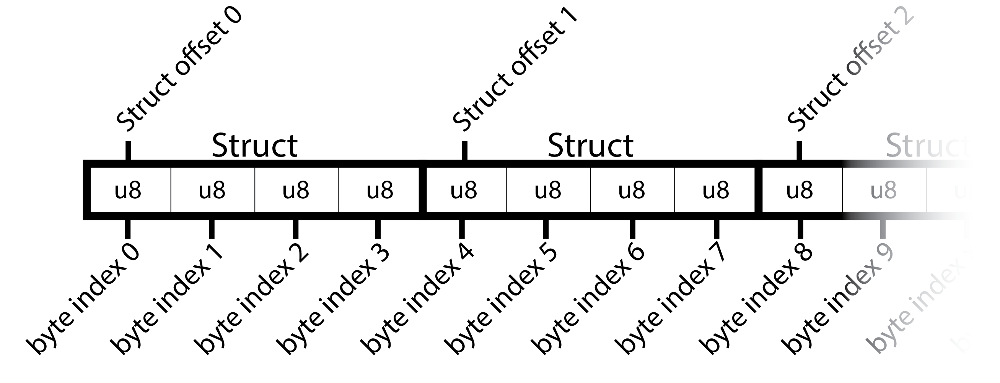
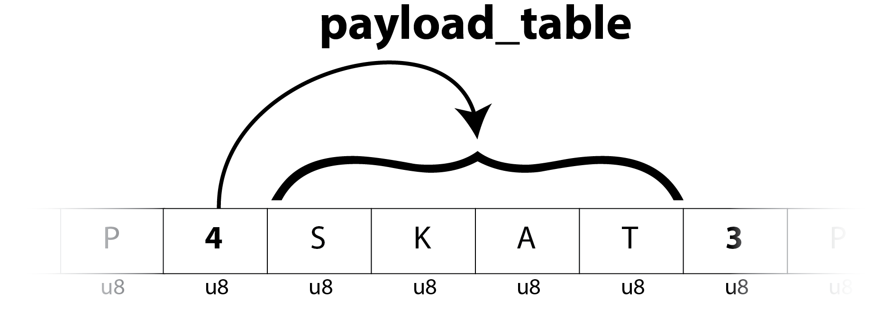
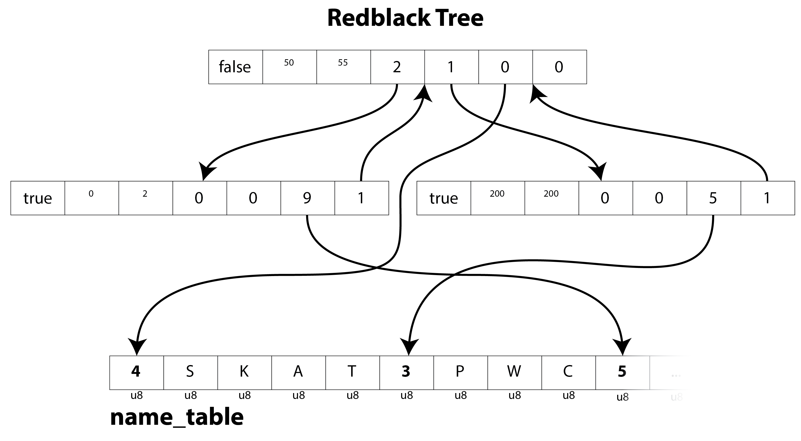
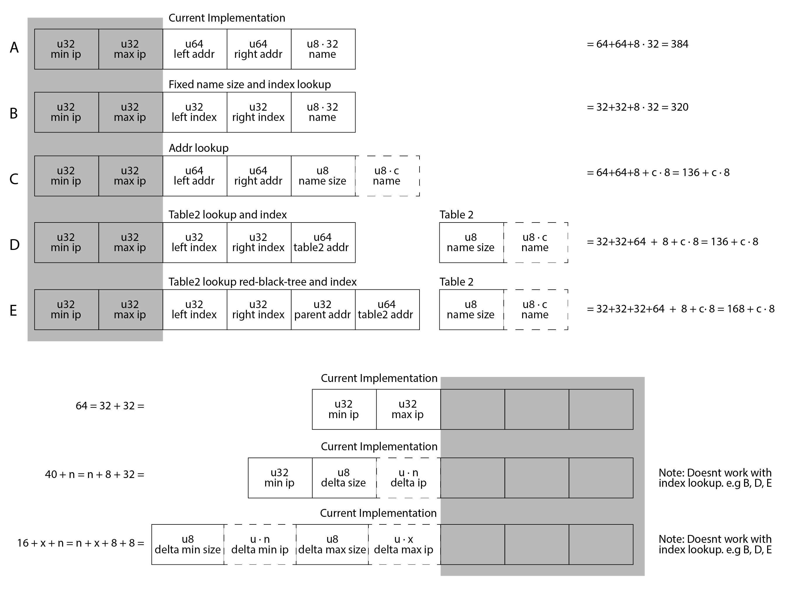
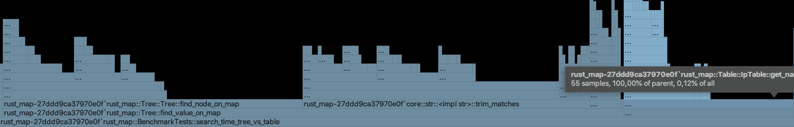
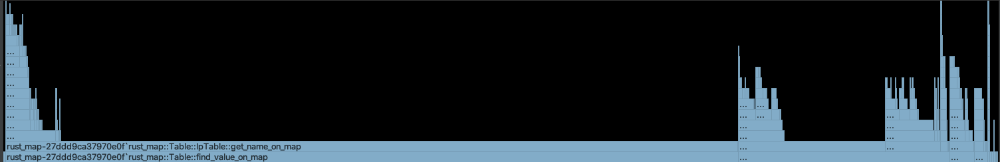

# Bachelor Report

# Intro - abstract
Speed is first priority


## Motivation

What do you do when you want to quickly search through a big data-set that cant be store in ram?
On a small scale the easy answer is to just buy a more powerful machine, but this is maybe not always what you want. Should you choose to run a given service on a virtual machine on a cloud-provider like _digital ocean_ then running a rending a machine with many resources quickly becomes expensive. This is where this problem becomes relevant.

## Problem explained in detail

Siteimprove needs a service that can look up information of a given ip-address. The primary focus is fast lookup so their customers can get a result as fast as possible.
Pre-processing time is not important as long as it doesn't take over day. 
It has to use under 
Space wise it doesn't matter much either, but again it has to be a realistic/practical amount.

### Data

The data is expected to be read from a file or read as a stream.
Each entry consist of two ip addresses and some related data/payload. The first ip determents the lower bound of the range and the second is the upper bound.
The payload can vary in size, but bla bla bla.

`
It is not possible to access to the real data due to confidentiality, but the avarage payload size pr. entry. is available. 
The system needs to handle 150 mil ipv4 ranges and 35 mil ipv6 ranges with a payload of 256 bytes.`

### Assumptions
* The input data contains no overlapping ranges
* No ip range is excluded (No ip range should be ignore because of reserved ip-range-blocks) / in other words... all ip addresses are possible.
* No need to remove or change entries after insertion. 
* The entries should should be able to be stream into the program so no way of knowing how many entries will actually go into the system

### the goal
Handle 150 mil entries of Ipv4
Siteimprove's wishes for a lookup time of p99 in 60ms.

The focus of this paper is the 150 mil entry ipv4 - but we will make referels towards ipv6.

### Si Rules/Priorities
```
- Language:             Rust.
- Dataset:              A set of IP ranges to firms.
                        No overlapping ranges. 
- Pre-processing-time:  Not important.
                        No new entries after first lookup.
- storage space:        Not important.
- Lookup-time:          Important.
```

### Si goals 
I couldn't test on Siteimprove's real data, since it confidential, but could get 
```
- Dataset:              150.mil ipv4
                        35.mil  ipv6
                        256bytes payload pr entry.
- Memory:               4gb
- Lookup-time:          p99 in 60ms.`
```

## Why rust?

"Rust is a multi-paradigm system programming language focused on safety, especially safe concurrency. Rust is syntactically similar to C, but is designed to provide better memory safety while maintaining high performance." - wiki

In a survey done by XXX 51% of the security vulnerabilities in the linux kernel is coursed by concurrency and memory safety issues that are fundamentally impossible to get in rust (unless you use the `unsafe` keyword, which is not recommended)

### Memory safety

"Rust is designed to be memory safe, and thus it does not permit null pointers, dangling pointers, or data races in safe code. Data values can only be initialized through a fixed set of forms, all of which require their inputs to be already initialized." - wiki

Guaranteed by Rust's ownership system - At compile time

This means if we have an array `[T]` of items and we create a reference to one of those items `&T` then the that reference needs to go out of scope before the array itself - otherwise the rust compiler wont compile because it can't guarantee that the array isn't de-allocated or changed before accessing `T`.
This is both a huge challenge when first starting to work with Rust, but also a really great safety.

Since rust have real references that it check and don't really use & "raw pointers" that you move around in C, then i was hoping i could use references on my nodes...

<table><tr><th>
Compiles
</th><th>
Doesn't Compile
</th></tr><tr><td><pre>
pub struct Node {
    pub min_ip: u32,
    pub max_ip: u32,
    pub left: usize,
    pub right: usize,
    pub name: [u8; 32],
}</pre></td><td><pre>
pub struct Node {
    pub min_ip: u32,
    pub max_ip: u32,
    pub left: &Node,    // Error
    pub right: &Node,   // Error
    pub name: [u8; 32],
}</pre></td></tr></table>
Sadly storing pointers/referenes doesn't work, so i opted to just store the byte-index of the node in Tree Memory map. 


### Error handling

```rust
pub(crate) fn get_u32_for_ip(v: &str) -> Option<u32> {
    let v: Vec<&str> = v.split('.').collect();
    if v.len() != 4 { return None }
    let mut min_array: [u8; 4] = Default::default();
    for i in 0..v.len() {
        min_array[i] = match v[i].parse() {
            Ok(n) => n,
            Err(e) => return None
        }
    }
    Some(u32::from_be_bytes(min_array))
}
```
This function takes a string of 4 numbers separated by a dot `.` - e.g. `192.2.103.11` and returns unsigned integer wrapped in a option.

instead of getting of semencation faults and similar, i can specifc
`BufReader::new(File::open(file).expect("Could not find file"))`

### ownership
https://medium.com/@thomascountz/ownership-in-rust-part-1-112036b1126b


`Rust has an ownership system where all values have a unique owner, and the scope of the value is the same as the scope of the owner. Values can be passed by immutable reference, using &T, by mutable reference, using &mut T, or by value, using T. At all times, there can either be multiple immutable references or one mutable reference (an implicit readers-writer lock). The Rust compiler enforces these rules at compile time and also checks that all references are valid.` - wiki
### Where rust falls short
Sadly sometimes we can cant use rust's safety, and this is where rust looks more like C
```rust
pub(crate) unsafe fn bytes_to_type<T>(slice: &[u8]) -> &mut T {
    std::slice::from_raw_parts_mut(slice.as_ptr() as *mut T, std::mem::size_of::<T>())
        .get_mut(0)
        .unwrap()
}
```
Here we have no guarantee of we are going to get, since it just a pointer and a length that we force to become a reference to type T. I this case we don't have any other way, since MememoryMap only know the concept of bytes.

Rust have the ability to call directly into C files, and you also have the abiilty use most of by using the `libc`- libarary. This means we can access functions like `mlock` and `mlockall`. But again rust can garantee these functions so we need to use the "unsafe" keyword.

Overall i believe rust is a great language for low level programming and it's safety and guarantees are great - and you can always tap into c.  but in some cases it run short when you are working directly on disk. 


https://medium.com/paritytech/why-rust-846fd3320d3f

https://stackoverflow.com/questions/33985018/cannot-borrow-x-as-mutable-because-it-is-also-borrowed-as-immutable
https://stackoverflow.com/questions/47618823/cannot-borrow-as-mutable-because-it-is-also-borrowed-as-immutable


# Data structures
The usually way of searching through persistent data is usually done by saving it in a database usually consisting of key-value entries stored in tables.

The data for this problem consist of ranges, which means that the choice of database type is not obvious, and depends on different factors. 
It depends on range-size, gap-size (between each range), payload-size pr. entry, how many keys there can exist in total, and number of entries - and of course how complicated of a implementation you want. 

For this problem i have chosen to look into tree and table structures. 

Lets declare some variables:
```
p = payload size in bytes
e = number of entries
```

```
address -> the offset in bytes from start of a memory mapped file
index -> the offset in nodes from start of a memory mapped file
```

<måske en reminder at ipv4 er en u32>

#### Fixed vs. dynamic payload length 
Depending on the problem you want to solve you can either choose to use the same fixed amount of space for each entry or have a dynamic size meaning you only use the necessary amount of space for each entry.
Dynamic payload is great, since you don't waste space on padding/empty payload, but the downside is that you have to store the addresses payload begins instead of only storing the index to the node/struct of payload you are referering to.


This natually means that the address pointer always will be a bigger number than the index pointer. Therefore it is not alway bennificial to use dynamic sized payload if the amount of pointers are huge, since the amount of space needed accumulates
This means that an address-pointer of 32b can only point to a max size of ~4.3 byte data 

<insert image>

This means that it is not alway benefitino to use a dynamic size, if the amount of pointers in the data structure is large, because each pointer has to be bigger, because a , because you need to store bigger sized-pointers because adresses 
This means that it sometimes are not beneficial to use dynamic, if amount of pointers in the data strucutre is large, because to the payload accumulates to a given amount. 

For this project i have chosen dynamic payload length, because the payload consist of names, which can vary a lot in length. If fixed length was chosen i would either have to accept a large amount of wasted space, or not allow names to be over a given length meaning i would cut of names.

## Binary Trees


### Introduction

A binary tree is a simple datastructure where you cut away half the nodes for each step you go down the tree. 
This means you have to look through log2(n) nodes before finding the right node. 

One of the choices you have to make is to decide on if you want to store the payload on the node it self or it should store a pointer to somewhere else with the payload. 

Storing payload works fine.
- No need to spend time on looking up the payload in a different file.
- If the payload is a dynamic size, then we will have to refer to addresses instead of indexes, which takes more space as explained above.
- One could argue that it is better for caching to store the payload in a differently file, because the nodes would be smaller and next to each other on disk and therefore make better use of locallity while searching down the tree.

Another interesting point is to decide on how you want to store the ip-addresses. the simplest solution is to store the lower bound ip and the upper bound ip - each take up 32 bit - Resulting in 64 bit pr. node. Anouther approach could be to only store the lowerbound and then store the delta to the upper bound - this is usuful if you know that the ranges will me small meaning you could get away with ouly storing the delta on single byte. This can be takeing even further to store a delta from the last nodes upper ip, to this nodes lower ip and store the internal delta. 
Or you could choose to only store the delta to 
This is only usefull optimizations if you know how the ranges and gaps are distibuted, but since we cant do that in this project we have just went with the simple solution and storing the full ip address for both upper and lower bound. 

### Redblack Tree

An extension of the binary tree is the redblack tree. A redblack tree is a self-balancing tree structure. This prevents the tree from being inbalanced in exchange of longer build time and bigger nodes. 
It was invented in 1972 by Rudolf Bayer.

to prevent the tree from being unbalanced one could implement a redblack tree.
Cons: Slower build time, more space usage

As donald knuth proves in XXX the bigger the 

The bigger the tree the more useless it becomes...

A balanced tree is maybe not need consindering the nature of randomness.
< måske sæt hans bevis ind? >

The time complexicty is overall/theroticly the samme. 
<Insert runtime >
```
Algorithm	Average	    Worst case
Space		O(n)	    O(n)
Search		O(log n)    O(log n)
Insert		O(log n)    O(log n)
Delete		O(log n)    O(log n)
```
<wiki>

"In 1999, Chris Okasaki showed how to make the insert operation purely functional. Its balance function needed to take care of only 4 unbalanced cases and one default balanced case"

<De 4 cases (5) bliver gennemgået her www.geeksforgeeks.org/red-black-tree-set-2-insert/ >
<måske skriv redblack om til functionel>


## Tables

The general understanding is that searching in tables are quicker than most data structures, because you can get the data by going directly to a specific index by using the key. 

The simple/naive implementation of this is to just create a full table for all ip-addresses holding a value for each ip. This obviously result in a massive data duplication because a value is stored repeatedly for each key in the associated range. This can easily be improved by actually storing the payload in another table and only storing a pointer to the payload.

<vis en fin tegning af at det er kode dublication>



The other downside is that you have to store a full sized table even though you may only have very few entries.

A solution is generally to create some kind of hashtable, where keys are hashed and points to some other datastructure (like a linked list).
But in this case you would still have to add each ip-value pair into the table. 


# Design

I this paper i have went for implementing a binary tree, a redblack tree, and a table. 
All tree datastructures use an external table for the payload. 

datastructures are implemented using memory mapped files.

for this implememation i have choosen to store strings as payload, but this could be swapped out with anything. 


## Payload Map

Both implementations use a separate memory mapped file for storing the payload/data, and the search map will then just use and index to determine where the data is stored on in the file.



**Space**

This means we can calculate the size of this file
`(avg(payload_size_in_bytes)+1) · number_of_entries`. `+1` because we need to add the size of the word. 

**Limitations**
calculate the max size for a payload
`2^8 = 256` - this means a entry can store up to 256 bytes. 

If we have 150.000.000 entries with 255 bytes each, we can calculate the largest possible file to be 38.4 gb
```
150.000.000 * 256 = 38.400.000.000 bits
38.400.000.000/1000/1000/1000 = 38.4 gb

This means we have a 

dynamic payload
(34.5-17.3)/(150.000.000/1000/1000/1000) = 114 bytes is the breakpointet.
```
Lookup time is constant. 

----------------------

here we have a simple example of what it would look like if the first entries were
```
0.0.0.50 0.0.0.55 SKAT
0.0.1.20 0.0.1.20 PWC
0.0.0.0 0.0.0.2 Siteimprove
...
```

## Redblack Tree


This tree consist of nodes. these nodes are structs and consist of ...

where the name field is a pointer to the address of the start of the payload stored in the payload_map. 

Each time a entry is added to the tree the a new node will be appended at the end. Because all nodes have the same size, we can point to their index instead of their absolute address.

```rust
pub struct Node {
    pub red: bool,
    pub min_ip: u32,
    pub max_ip: u32,
    pub left: usize,
    pub right: usize,
    pub parent: usize,
    pub name: usize,
}
```
The only difference from a regular tree is the added parent pointer and color boolean.


48bytes -> 48*8
https://doc.rust-lang.org/std/mem/fn.size_of.html
https://www.geeksforgeeks.org/is-sizeof-for-a-struct-equal-to-the-sum-of-sizeof-of-each-member/

**Space**
`8(bool)+32+32+64+64+64+64 = 328 bit` pr entry meaning we get a file of `49.200.000.000 bits` which is `49.200.000.000b/8/1000/1000 = 6,15 gb`. 

**Implementation overview:**
``` 
Speed: 2 lookups
Space: <fix bit vs bytes>
    tree_table:     (4 · 64 + 2 · 32 + 8) · e = 328 · e
    payload_table:  (1 + p) · e
```

**Handling IpV6**
Tree structures handles IpV6 well. The only change nessesary would be to change the `min_ip` and `max_ip` to be a `u32`/`usize`. This would increase all nodes sizes with 2 · 32 bits.

---




Lets split this up into two problems: _range storage_ and _pointer/payload storage_

Depending on if you want to handle ipv6 or not you have to choose 

##### range storage

##### payloadstorage


```

ipv6 - solution E
30.000.000*232 / 8 /1000/1000/1000 = 0.87gb 

2^32/256

#table2
30.000.000 * 256/1000/1000/1000 = ~7.7gb
```


---

## Table


This would result in
```
(1+256) · 150000000 = 38.550.000.000 bytes = 308.400.000.000 bits
```
This means that 32 bit is not big enough to store all the  
2)


**Space**
best and worst case:
```
(2^32)*32/8/1000/1000/1000 = 17.2 gb
(2^64)*32/8/1000/1000/1000 = 34.4 gb
```
Since we build a full table it doesn't matter how many entries we get - the size will stay the same. 

**Implementation overview:**
``` 
Speed:
    constant time. 2 lookups. O(1).
Storage:
    ip_table: 2^32 * 32
    payload_table: (1 + p) · e
```

**Handling IpV6**
This implementation wont work for IpV6.
IpV6 is 128 bit instead of IpV4's 32 bit.
`2^128 = 3,40e38b`
`3,40e38/8/1000/1000 = 4,25e28 gb`
This solution would never work in practice. 

# Testing


### Input Cases
- Payload pr. range
- Distance between ranges
- number of ranges
- Range size
- IPv4 or IPv6
- mutable structure vs. dynamic insertion 

### Test Variables:
- ram 
- Space
- lookup time
- build time


The automated test script can be found in appendix X, but the overall structure is explained in this section. 

## Simple unit tests
Most functions are tested by simple unit tests. 


## speed testing
All tests are executed on a droplet (virtual machine) on Digital Ocean (cloud provider), 
Closed envorimentent and fixed resources. 

Test process:
* Copy src files to droplet with `SCP-command`
* 

clear cache between search through


to mimic a real scenario, we you choose to go for such an implementation because of resource limitations.

```
pub fn generate_source_file_with(s:&str, n: u32, range: Range<u32>, padding: Range<u32>, name_size: usize) { ... }
```

## Setup
**Generating test files**
Created a function that generate a text file where each line is 2 IP addresses and 1 name
e.g.: `125.74.3.0 125.74.3.10 Siteimprove` 
each line is written direcly to a file and
and afterwards shuffled by using the unix command `shuf`. It was necessary to print them to the file immediately instead of shuffling them in ram, because all 150 million entries could be in ram at the same time.

## Build
**When running:**
The program iterate over each line reading them one by one with regex. <insert ref here>
This step is derterimistic, so i only need to run this each time i generate a new source file. 

## lookup
**Choosing random lookups**
The lookup ip are collected by running over the shuffled list of entries and collecting every 1000 entry. a random ip is picked between the upper and lower boinds. These ip are then shuffled again and then used for search lookups 

## search


This search through can be parallelized. Should this be used as a real service it can easily be parallix as long as it only reads. 

for testing/benchmarking perposeses the lookups are run sequentile to find the avarage lookup time pr request. 

Both the tree and table search test goes through the same steps:
* generated random requets
* init memory map references
* iterate over the requests check that all of them is found in in the table/tree
* print the result

```rust
#[test]
fn search_time_table() {
    println!("## search_time_table");
    let src = DO_Benchmark_test_src;

    let requests = FileGenerator::generate_lookup_testdata(src,1000);
    let length = requests.len();
    assert!(length > 0);

    let lookup_table = Table::gen_lookup_table();
    let ip_table = Table::gen_ip_table();
    let mut numberSkipped = 0;

    let mut sw = Stopwatch::start_new();
    for (ip, name) in requests {
        let value = Table::find_value_on_map(ip, &lookup_table, &ip_table);
        if value.is_some() {
            let value = value.unwrap();
            if name != value {
                numberSkipped += 1;
                //println!("Wrong match - real: {} - found: {} - ip: {}", name, value, ip);
            }
        } else { println!("Found none - real name: {} - ip: {}", name, ip) }
    }
    sw.stop();
    println!("--- table score : {}, #{} of requests ran, #{} skipped", sw.elapsed().as_micros(), length, numberSkipped);
}
```

### Optimizations 

A huge part of the performance came from using a profiler
The profiler used for this project was the build-in profiler-tool in _Jetbrains Clion_, which is Jetbrains low-level-programming IDE. 

<Get better images>




<nævn noget om hvilken type profiling det er >
This was mainly used for seeing how much time the process spend in each scope/stackframe/function to find bottlenecks.

this han been great for learning Rust. 

### Debugging
* Stepping through the debugger


**printlines**

It has also been used to check if tree was strcutured correclky. Both binary tree and the redblack tree module has a function for printing the tree, and also a test to verify that the tree is printet correcty. 


* Printing tree
```
--red
-black
black
-black 
```


## Test Results


One of the biggest problems i encouterd was i coulndt build the redblack tree from the whole dataset, but only on smaller datasets. 

The program 

```
## search_time_tree
DO_BenchmarkTests::search_time_tree
--- Tree : #79213144 micro seconds, #149850 of requests ran, #0 failed
114.919801097 seconds time elapsed

## search_time_table
DO_BenchmarkTests::search_time_table
--- table : #105057148 micro seconds, #149850 of requests ran, #0 failed
```
This means i am able to process 149850 ip adress request in 105057148 micro seconds milliseconds, which is XXX request/milliseconds


# Evaluation

Both table and the tree was under goal given from Siteimprove. 


The table is clearly not practical for handling ipV6
The table has duplicated data


## Code wise?


## design choices?


## Test Data

## page swapping

Here we can observe that the tree is quicker than the table. This again sounds weird considering 

When doing ~150000 (149850) search throughs (every 1000 entry) seaching in the table and tree, we see that the tree is actually slower than the table. 

The reason for this could be happen would be that 

"your mmap'ed file in memory is loaded (and offloaded) by pages between all the levels of memory (the caches, RAM and swap)."

The requets are random, and all the ranges are close to evenly distributed over the whole ipv4-range. This means that all entries are equally likely, and there is no pattern in what ips are accessed. that kernal has no way of guessing what to load next.

Since the ddroplet has a limited amount of memory, memmap abstaction has to load and offload pages between disk and memory continuously. 


If the table needs random access, then the kernel can't guess what to load and offload, so it just has to pick something. 
In each node and its children are generally stored on the file close to it (They get futher appart the deeper you go in the tree). This means that the kernal can access mulitblie nodes at the same time, since they are loaded in the same page. This means that the kernel can actually search from "left to right" when searching for a nodes (and never from right to left, when it does go up the tree), which should be relativly quick. 

They could also answer why the balanced tree sometimes are a little slower than tree. Because the balancing effect makes sure that it can back and forth when accessing pages.

The page size on the vm is 4096 bytes, and each node is 48 bytes, meaning that each page store ~85 nodes


In general we can say that truly random access to a few bytes of data on a file should expect awful performance and if you access contiguous chunks sequentially from both files alternatively, you should expect decent performance.


https://stackoverflow.com/questions/43541420/when-and-how-is-mmaped-memory-swapped-in-and-out


On thing that i noticed when running the search test was that the tree search sped up. 
This was also the case for the table but way less noticeable. This follow the reasoning 


This is also noticable when doing 1485148 searches (every 100) in the table on the 2 gb mem droplet and the 8 db droplet. Here we could expect the 8 bg droplet to perform much better, since it didnt have the offload as much as the 2 gb droplet. As seen below this was not the case. They perform almost the same

```
100 gap 2 gb
## search_time_table
----------------------------------------------------------------------------------------------------
Search time --- #640696794 micro seconds, #1485148 of requests ran, #0 skipped
Search time --- #624812422 micro seconds, #1485148 of requests ran, #0 skipped

100 gap 8bg
## search_time_table
Search time --- #711256037 micro seconds, #1485148 of requests ran, #0 skipped
```

When doing the searches i tracked the memoery usage on the droplet.
Both droplets on with both tree and table searches had a peak memory usage of 120 mb.
This limit was reaced after only searching though 2 procent of the request. and they it stayed pretty stable.
While testing it 


### redblack tree

In C memmap, mlock and all in the same familiy of functions and you can use them toghter. In rust there is no such thing. 
There is a type called `Pin<>`, where can pin memory in ram and 

I haven't managed to find a single place online where pinning and MmupMap is used/mentioned together, making me believe they were either not mean to be used togther or no one have every tried. 

i made a test where i ran the redblack tree build, and locked all nodes with mlock (the unsafe c function), and the program died after 1000-1100 nodes. I was quicly to see if this was the whole program in itself that had a limit or it was just the MmupMap . So to test this i also added the mlock to the binary tree, and builded them sequentially without unlocking anything and that ran didt crash. This means that the limit is not on the process, but on the memmap. 

This was maybe 

What you would expect from a memmap would be to load in page after page in only 


When 


```rust 
fn get_node_raw<'a>(mmap: &'a MmapMut, offset: usize) -> &'a mut Node {
    let byte_map = &mmap[offset..(offset+NODE_SIZE)];
    let number = unsafe { libc::mlock(byte_map.as_ptr() as *const c_void, byte_map.len()) };
    assert_eq!(number, 0);
    node_from_bytes(&byte_map)
}
```

## Cache 

In theory the cache shouldn't matter if the data-set consists of an infinitely large amount of entires, because the cache would be thrashed anyways.

but on a more realistic scale (like in this project) this can become a factor when i comes to speed.

The immediate thought would be that the tree would benefit from this, since the nodes closer to the root would be read much more often than the rest of the tree, meaning that the data stored in the upper nodes can be retrieved from the cache. 

For testing the cache i used linux command `perf stat -e task-clock,cycles,instructions,cache-references,cache-misses [input]` on the droplet. 


It is difficult to isolate the cache-miss counting to the searchign only. This means the 3 results include generating the searh input, searchin in table/tree, and looking it up in the payload_table. This means that generating and looking in payloads_table should be stable for all 3 tests, 

The tress always hit around 30% cache-miss. 
the table vary from 30-60% cache miss, depending on if the compiler made optimizations and on higher 

<Anden teori... når --release er sat så kører tabellen mere uoptimeret.>


// bench28marts.txt - 20.000 entries
```
## search_time_table
Performance counter stats for 'cargo test --color=always --package rust_map --bin rust_map DO_BenchmarkTests::search_time_table -- --exact --nocapture --ignored':
          66271809      cache-references          #   24.496 M/sec                  
          40300257      cache-misses              #   60.811 % of all cache refs    
```
```
## search_time_tree
Performance counter stats for 'cargo test --color=always --package rust_map --bin rust_map DO_BenchmarkTests::search_time_tree -- --exact --nocapture --ignored':
           3757577      cache-references          #   22.171 M/sec                  
           1279301      cache-misses              #   34.046 % of all cache refs    
```
```
## search_time_redblack
Performance counter stats for 'cargo test --color=always --package rust_map --bin rust_map DO_BenchmarkTests::search_time_redblack -- --exact --nocapture --ignored':     
           3682037      cache-references          #   22.464 M/sec                  
           1293555      cache-misses              #   35.132 % of all cache refs    
```
//bench29marts.txt
1.000.000 entries 9900 requets

```
## search_time_tree
Performance counter stats for 'cargo test --release --color=always --package rust_map --bin rust_map DO_BenchmarkTests::search_time_tree -- --exact --nocapture --ignored':
           6106911      cache-references          #   19.203 M/sec                  
           1968104      cache-misses              #   32.227 % of all cache refs    
```
```
## search_time_redblack
Performance counter stats for 'cargo test --release --color=always --package rust_map --bin rust_map DO_BenchmarkTests::search_time_redblack -- --exact --nocapture --ignored':      
           6150624      cache-references          #   19.068 M/sec                  
           1770820      cache-misses              #   28.791 % of all cache refs    
```
```
## search_time_table
Performance counter stats for 'cargo test --release --color=always --package rust_map --bin rust_map DO_BenchmarkTests::search_time_table -- --exact --nocapture --ignored':    
           4971538      cache-references          #   19.851 M/sec                  
           1492896      cache-misses              #   30.029 % of all cache refs    
```

### Enchantments / Next Steps 

* Upgrade to redblack tree
* Actually adding a nice api, instead of only running the code through testfuctions/benchmarks.
* No reason to individually place each enty to the ip_table... i could just add them to an array in memory and then place that on disk
* The red-tag could be part of the names first bit - because otherwise it takes 64 bit

# Conclusion  

# References
https://doc.rust-lang.org/1.30.0/book/second-edition/index.html
https://doc.rust-lang.org/1.30.0/book/first-edition/iterators.html
https://doc.rust-lang.org/1.30.0/book/first-edition/the-stack-and-the-heap.html
https://rust-lang-nursery.github.io/rust-cookbook/concurrency/parallel.html
https://rust-lang-nursery.github.io/rust-cookbook/web/scraping.html
https://rust-lang.github.io/async-book/01_getting_started/02_why_async.html

# Appendix


### Siteimprove Data
```
IP v4 entries for isp is 177765
IP v6 entries for isp is 29846
IP v4 entries for mcc is 19547
IP v6 entries for mcc is 563
IP v4 entries for asn is 307279
IP v6 entries for asn is 38018
IP v4 entries for org is 9661299
IP v6 entries for org is 891625
IP v4 entries for domain is 17229245
IP v6 entries for domain is 3164
IP v4 entries for pulse is 124127485
IP v6 entries for pulse is 34027618

124127485+ 17229245+ 9661299+307279+ 19547 + 177765 = 151.000.000
29846 + 563 + 38018 + 891625 + 3164 + 34027618      =  35.000.000
```
