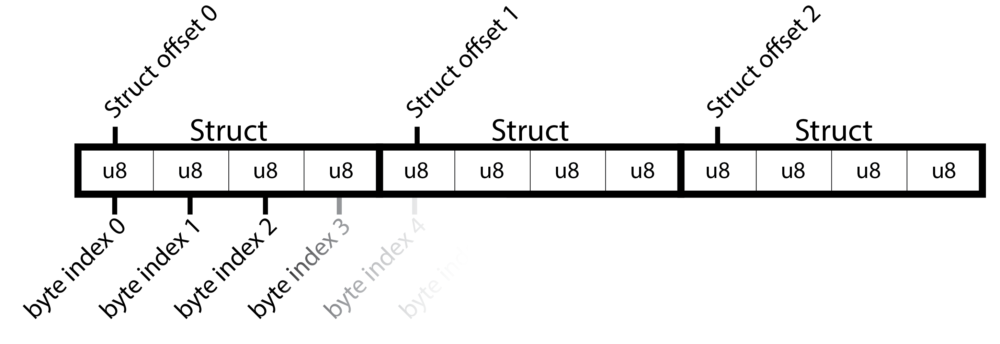
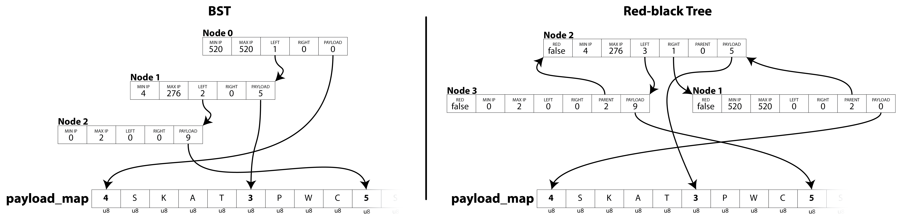
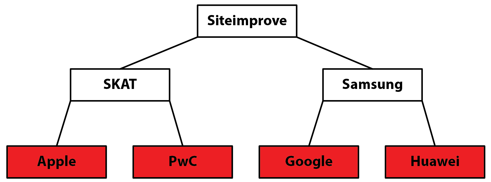
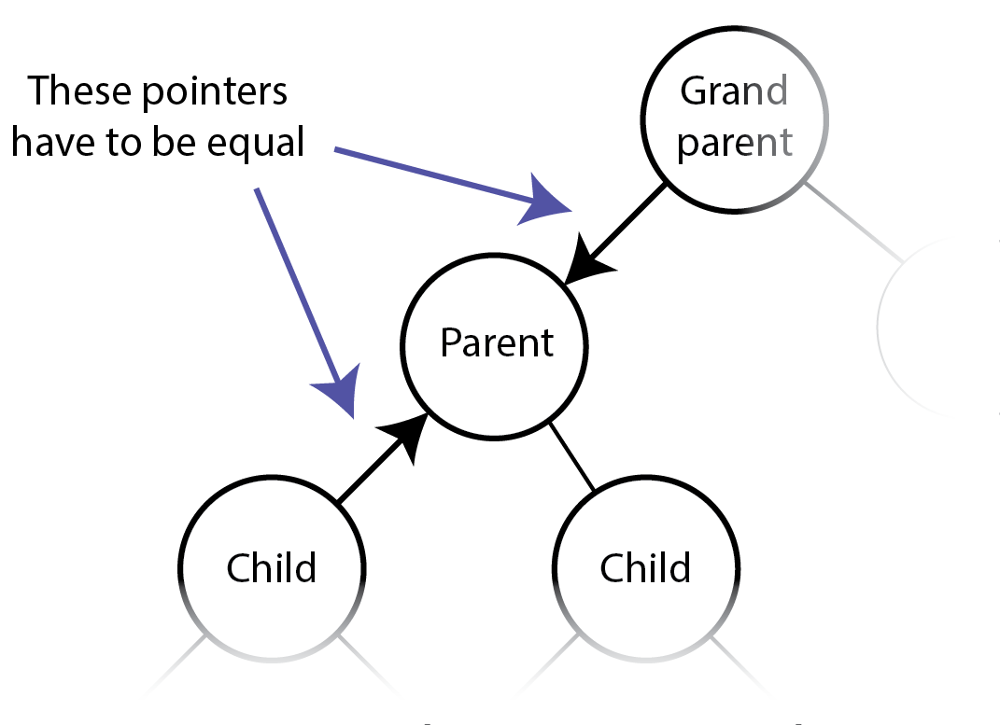
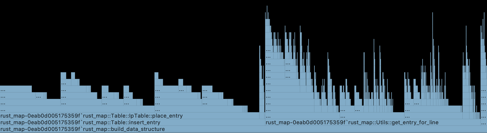
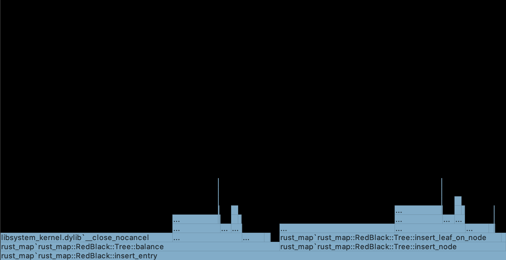
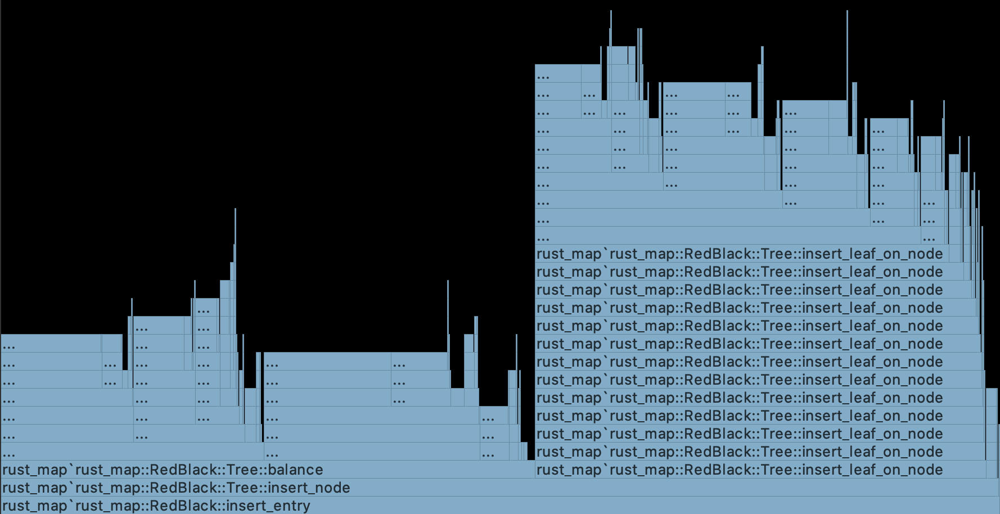
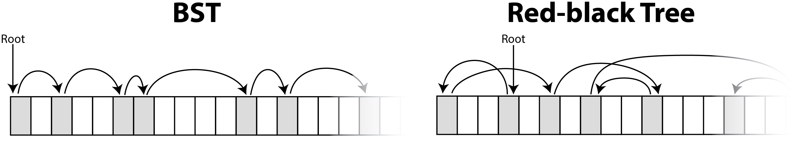
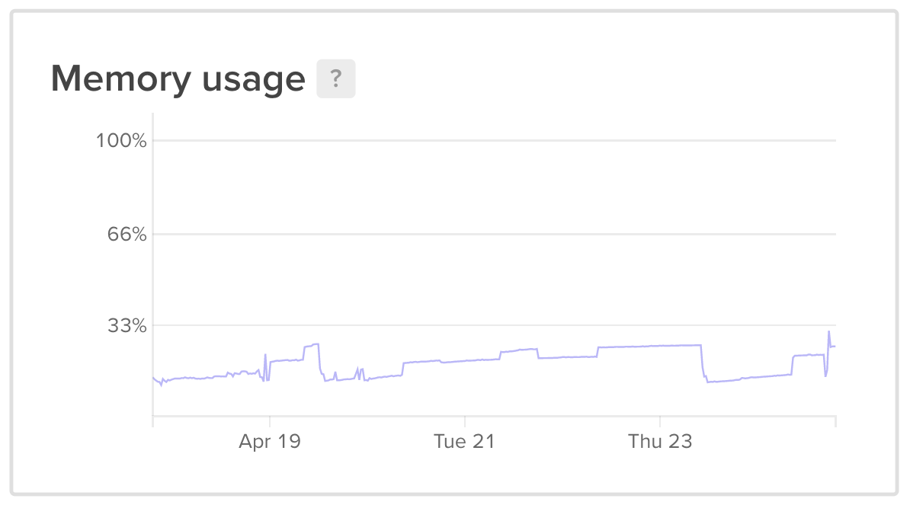

# Bachelor Report

# Intro - abstract
Speed is first priority

## Motivation

What do you do when you want to quickly search through a big data-set that can't be stored in memory? On a small scale, the easy answer is to just buy a more powerful machine with more memory, but this is maybe not always what you want. Should you choose to run a given program on a virtual machine on a cloud-provider like _digital ocean_ - than renting a machine with high resources quickly becomes expensive. This is where this problem becomes relevant.

If the data can't be stored in memory it needs to be stored on persistent storage. This is usually done by tables with key-value pairs, but what if the keys are ranges between two values, then design choices are more complicated.

## Problem formulation:	
- Analyze the requirements from Siteimprove in terms of persistent log and key-value store
- Describe and analyze existing data structures and algorithms for persistent log and key-value stores
- Design/implement/evaluate a persistent log and key-value store in Rust on modern hardware

## Method:	
The method is experimental. I will design, implement, and evaluate a prototype.

## Problem explained in detail
Siteimprove needs a web-service that can lookup information of a given IP address. 

The structure around the service (handling http request and so on), is already implemented, so they need the new algorithm for the actual data storage and lookup. Siteimprove's service is implemented in Rust, and therefore they want the search algorithms to be implemented in Rust (or a language that can port to Rust).

The primary focus is fast lookup so their customers can get a result as fast as possible. Pre-processing time is not important as long as it doesn't take over a day. Space is not important, since disk storage is relatively cheap, but if it had to be run on a cloud provider, it should be kept under 100 GB persistent storage.

The data structure needs to be built once a week and doesn't need to handle any new entry insertions after the data-structure has been built. 

Siteimprove wants a lookup time of a maximum of 40 milliseconds on average pr. request. That is the highest lookup time they want to offer to their customers. 

Part of the challenge is to be able to run the service on a machine with low resources in order to pay less for hardware in the long run (especially if run on a cloud provider). The maximum memory usage should be 4 GB memory, but I will strive for as low memory usage as possible. 

Siteimprove has no need for persistent logging. 

### Data

The data is expected to be read from _standard input_ from a file or read from a stream. Each entry consists of two IP addresses and some associated data/payload. The first IP determines the lower bound of the range and the second is the upper bound.

The payload pr. entry can vary in size, but the max payload size is 2^8/256 bytes. It is not possible to access the real data due to confidentiality, but the average payload size pr. entry is available. The number of entries is not constant, so the system needs to be able to handle an arbitrary number of entries. We know the typical average entry size, which we will use to test up against in this project. 

Siteimprove’s system needs to handle 150 million IPv4 entries and 35 million IPv6 entries with a payload of 256 bytes. To limit the scope of this project I will focus on the 150 million IPv4 and draw parallels to how the different data structures would handle IPv6.

So, to summarize the conditions / goals:

### Siteimprove’s rules/priorities
```
- Language:             Rust (or some other language that can port to Rust).
- Dataset:              A set of IP ranges with payload.
                        No overlapping ranges. 
- Pre-processing-time:  Less than a day.
                        No new entries after first lookup.
- storage space:        At most 100GB.
- Lookup-time:          First priority.
                        At most 60 milliseconds for average lookup time. 
- Dataset:              150.mil ipv4.
                        Up to 256bytes payload pr. entry.
- Memory:               At most 4GB.
```

**Assumptions of data**
* The input data contains no overlapping ranges
* No IP range is excluded (No IP range should be ignored because of reserved IP-range-blocks) - In other words all IP addresses are possible.
* No need to remove or change entries after insertion. 
* The entries should be able to be streamed into the program so there will be no way of knowing how many entries will actually go into the system

# Data structures
There are many ways of searching through key-value pairs. The data for this problem consists of ranges, which means that the choice of database type is not obvious and depends on different factors. It depends on range-size, gap-size (between each range), payload-size pr. entry, how many keys there can exist in total (if the possible IPs are a finite set), and the number of entries - and of course how complicated an implementation you want. 
This project focuses on tree structures and simple tables.

For this section we will refer to/use these variables:
```
p = payload size in bytes
n = number of entries
```
## Tables

A simple implementation of a table is to just create a full table for all IP addresses holding a value for each IP. Obviously, this results in massive data duplication because a value is stored repeatedly for each key in the associated range. This can easily be improved by storing the value in another table and only storing a pointer to it. Now the value is only stored once, but instead the pointer to it is duplicated for each key. 


One of the downsides to this is that the full IP range is stored in the database even though you may only have very few entries. A solution is generally to create a hashtable, where keys are hashed and point to some other data structure (like a linked list), but this is beyond the scope of this project. 

## Binary Trees

To prevent having a lot of duplicated pointers, another option is to store each entry as a node in a tree. A binary tree is a tree where each node has one parent and up to two children. A tree corresponding to the binary search algorithm achieves the theoretical minimum number of key comparisons that is necessary to find a value <ref til Knuth side 426>. Binary search has a search time complexity of O(log n), which means that we should aim for a tree structure with the same time complexity.

### Binary Search Tree (BST)
BST is a type of binary tree in which the left child of a node has a value less than the parent and the right child has a value greater than the parent.

On average, binary search trees with n nodes have O(log n) height. However, in the worst case, binary search trees can have O(n) height. 

One of the choices you have to make is to decide if you want to store the payload next to the node itself or the node should store a pointer to the payload somewhere else. 

Pros for storing the payload in the node:
- No need to spend time looking up the payload in a different file.
- The payload is probably already cached because it is right next to the node it just accessed.

Pros for storing it in a separate file:
- In terms of caching it can be more beneficial to store the payload on a different file because it would mean that the nodes would be closer to each other - meaning they, therefore, make better use of locality while searching down the tree.

Another interesting point is to decide on how you want to store the IP addresses. The simplest solution is to store the lower bound IP and the upper bound IP - When talking IPv4 each take up 32 bits, resulting in 64-bit pr. node.
Another approach could be to only store the lower-bound and then store the delta to the upper-bound. This is useful if you know that the ranges will be small, meaning you could get away with storing it on fewer bytes than 4 (32 bit). This is only useful optimizations if you know how the ranges and gaps are distributed, but since we can't do that in this project we have just gone with the simple solution storing the full IP address for both upper and lower bound. 

### Redblack Tree

An extension of the Binary Search Tree is the redblack tree. A redblack tree is a self-balancing tree structure. This prevents the tree from being imbalanced in exchange for longer build time and bigger nodes.
Studies have shown that the redblack tree is the tree with the least performance variations.
https://en.wikipedia.org/wiki/Binary_search_tree

On important point to make is that it is not always beneficial to use a balanced tree. As Donald Knuth proves in *The art of computer programming, Volume 3, Sorting and searching, second edition, page 430* the search time for the balanced tree is not much better than a non-balanced tree on random data. An unbalanced tree has a worse case search time of `O(n)`, but this is very rare and most trees are well balanced. A redblack tree has a `~Log(n)` and a BST has a `~2·log(n)` search time. Which mean both data-structures has a time complexity of `O(log(n))`. This means that the increasing price of rebalancing the a redblack tree on large random data inserts, may not always be worth the lower height.
It has been shown, by Chris Okasaki, that insertion in a redblack tree only needs to handle four cases, which makes it easy to implement for project like this. 

<ref Okasaki, Chris (1999-01-01). "Red-black trees in a functional setting". Journal of Functional Programming. 9 (4): 471–477. doi:10.1017/S0956796899003494. ISSN 1469-7653. Archived from the original (PS) on 2007-09-26. Retrieved 2007-05-13.>
<De 4 cases (5) bliver gennemgået her www.geeksforgeeks.org/red-black-tree-set-2-insert/ >

# Implementation

## Why use rust?

Rust is a multi-paradigm system programming language focused on memory safety, especially safe concurrency. - wiki source please

Rust performs similar to C, which makes a good choice for performance. 
https://benchmarksgame-team.pages.debian.net/benchmarksgame/fastest/rust.html


### Safety

**Memory safety**

One of the main reasons of using rust is its safety. In general, Rust doesn't allow null pointers, dangling pointers, or data races.
This is done by a combination of the concept of ownership (which is basically a restriction of only having one mutable reference) and lifetime (which tracks how long something is in scope). All these are fixed are enforced at compile time.

```
Each value in Rust has a variable that’s called its owner.
There can only be one owner at a time.
When the owner goes out of scope, the value will be dropped.

This also eliminates C's issue of double free error. 
```

Rust has a concept of lifetimes. This means that if we have an array of items `[T]` and we create a reference to one of these items `&T` then that reference needs to leave scope before the array itself. In other words, the array needs to have a longer lifetime than outside pointers to its elements - otherwise, the Rust compiler will not compile because it cannot guarantee that the array is not freed or changed before accessing `T`. This is both a huge challenge when first starting to work with Rust, but also a great safety. This is great for this project, because we eliminate change of dangling pointers, which can be a pain, when building a complex data structure with a lot of moving pointers. 

Starting this project is was the plan to let nodes refer to each other by using a `&T` when building a tree. But because of these compiler challenges mentioned above, I chose to instead go for an implementation where each node stored a byte-offset to where its children were stored the memory map. 

**Reading from Memory Map**
Sadly, sometimes we can cannot use Rust's safety, and this is where Rust works more like C.
```rust
pub(crate) unsafe fn bytes_to_type<T>(slice: &[u8]) -> &mut T {
    std::slice::from_raw_parts_mut(slice.as_ptr() as *mut T, std::mem::size_of::<T>())
        .get_mut(0)
        .unwrap()
}
```
This function returns a reference to a mutable object given a reference to a `u8` array. This function is used to get a reference to a node directly on the memory map. Here we have no guarantee of what we are going to get, since it is just a pointer and a length that we force to become a reference to type `T`. I this case we do not have any other way since Memory Map only knows the concept of bytes.

**Error handling**
C does not provide good error handling, because the programmer is expected to prevent errors from occurring in the first place. -wiki source? This means that C is much harder and unsafe to code combined with the fact that it is very difficult to debug. 

https://en.wikibooks.org/wiki/C_Programming/Error_handling

High level languages like java and C# have mechanisms such as exceptions. Rust does not have exceptions. Instead, Rust has two types of error handling `Result<T, E>` and `Option<T>`. Option can be seen as the same as a Result but without an error object. 
```rust
pub(crate) fn get_u32_for_ip(v: &str) -> Option<u32> {
    let v: Vec<&str> = v.split('.').collect();
    let len = v.len();
    if len != 4 { return None }
    let mut acc: u32 = 0;
    for i in 0..len {
        match v[i].parse::<u8>() {
            Ok(n) => acc |= (n as u32) << ((len-1-i) * 8) as u32,
            Err(e) => return None
        };
    }
    Some(acc)
}
```
Both concepts are used in the function above. Option is used in the form of `Some` and `None` and Result is used in `Ok(n)` and `Err(E)`. This function takes a string of four numbers separated by a dot `.` - e.g. `192.2.103.11` - and returns an unsigned integer wrapped in an Option. In this case, I use Option as a safe way to use a null-pointer. Being able to handle an error with ease is crucial when needing to deliver save code quickly. 

### Rust combined with C
Rust does not have an official interface/abstraction for using memory maps, but there exists a few open-source libraries created by the community. 
Rust's package management system is called *cargo* and it uses the crates as the packages. This project uses a crate called `memmap` (version `0.7.0`). This library was chosen because it had the most stars on Github. The abstraction provided by the external libraries is not extensive compared to the one in the C standard library, meaning that the configuration for the map is not as customizable. 
Rust has the ability to call directly into C files, and you can also use most of the C standard library inline by using the `libc`- library/crate. This means we can access functions like `mlock` and `mlockall`. `show example`. But Rust’s memory safety cannot guarantee the result of these functions so it forces us to use the "unsafe" keyword. Overall, this means that we can use both Rust functions and C functions as we please, but we cannot guarantee what is going to happen.

https://doc.rust-lang.org/nomicon/ffi.html

https://medium.com/@thomascountz/ownership-in-rust-part-1-112036b1126b

https://medium.com/paritytech/why-rust-846fd3320d3f

https://stackoverflow.com/questions/33985018/cannot-borrow-x-as-mutable-because-it-is-also-borrowed-as-immutable
https://stackoverflow.com/questions/47618823/cannot-borrow-as-mutable-because-it-is-also-borrowed-as-immutable


## Design
I this project I have chosen an implementation of a Binary Search Tree, a redblack tree, and a table. All three implementations have their own module in the source code and have the same interface, so they can be swapped interchangeably. All data structures are implemented using memory-mapped files. All three implementations use a separate memory-mapped file for storing the payload/values. This memory-mapped file will be referred to as `payload_map`.
In this all three implementations, I have chosen to store strings as payload, but this could be swapped out with any other data type.

Before diving deeper into the implementations, I want to highlight the difference between fixed data sizes vs dynamic data sizes. 

#### Fixed vs. dynamic data length 

Depending on the problem you want to solve you can either choose to use the same fixed amount of space for each entry or have a dynamic size (meaning you only use the necessary amount of space for each entry). 

This choice is important for deciding how to store the payload and how we store the nodes in the tree, and how big the pointers to the payload need to be.

Fixed sized data could imply using a struct - meaning that the whole file is cut in equal-sized pieces (structs). This means you can refer to the offset of the struct itself, and not to the byte index of the struct. This is important because the byte-index number will be much larger than the struct offset, meaning it takes more space to store pointers to byte indexes.


Struct offsets are great if you know the data-object always will have the same size, but if the amount of data needed to be stored varies a lot, then we will waste space on internal padding in the structs because they are not filled out. This means we instead can make all data-objects have a dynamic size. This would result in us having to store the size of the data object in the header (because we do not know the size of it) and need to use byte-index to refer to the data. 

### Payload Map
This memory-mapped file contains all entries' value and the length of the values in bytes. A value is retrieved from the map by giving it the byte index of the header of the value. Each lookup runs in constant time and therefore has a time complexity of *O(1)*. 

Each value has a header of one byte, which is used to store the length of the data. The length is necessary because we do not know how far we need to read to get the value. The length of the payload is stored on 1 byte, which means that the payload can be at most `2^8 = 256` bytes long. This is just a design choice but could easily be extended by changing all headers – they would need to be 2 bytes long instead. 

On this picture we can see how *SKAT* would be stored.


**Space**
The space needed for this file can be calculated from the max payload size and the number of entries: `(255 + 1) · n`, where `n` is the number of entries. The `+1` is the header-size of one byte. If we have 150.000.000 entries with 255 bytes each, we can calculate the largest possible file to be 38.4 GB.

## BST & Redblack Tree

Both the BST and the redblack tree are implemented very similarly. Most functions are exactly the same, but with the exception of the insert-function (`fn insert_node(...)` in the source code) in the redblack tree being pretty extensive and the fact that the redblack tree has functions for changing the root-node. 

The nodes in the two trees are declared as followed:
<table><tr><th>
BST
</th><th>
Redblack
</th></tr><tr><td><pre>
pub struct Node {
    pub min_ip: u32,
    pub max_ip: u32,
    pub left: u32,
    pub right: u32,
    pub payload_ptr: u64,
}</pre></td><td><pre>
pub struct Node {
    pub red: bool,
    pub min_ip: u32,
    pub max_ip: u32,
    pub left: u32,
    pub right: u32,
    pub parent: u32,
    pub payload_ptr: u64,
}</pre></td></tr></table>

>`min_ip` being the lower-bound IP, `max_ip` being the higher-bound IP, `left` being the left child, `right` being the right child, `parent` being the parent node and `payload_ptr` being a pointer to the `payload_map`, and `red` is the indicator of the node being red or black.

The `min_ip` and `max_ip` are a `u32`, because IPv4 is 32-bit. Pointers to other nods are `u32`, because we know that there will be at most 2^32 nodes, when the tree only handles IPv4.

**Insertion**
Each time an entry is added to the tree a new node will be appended at the end of the memory mapped file. Because all nodes have the same size, we can point to their node-offset instead of their byte-offset. The only difference between the two trees is how we store the root-node. In the BST we store the root node on struct offset 0 and in the redblack tree we store a pointer to the root-node  in the first struct.



Here we have a simple example of what it would look like if these entries were inserted. 
```
0.0.2.8 0.0.2.8 SKAT
0.0.0.4 0.0.1.20 PWC
0.0.0.0 0.0.0.2 Siteimprove
```

Here we notice that the BST is not balanced and has Node 0 as root and redblack is balanced and has Node 2 as root. Reference to another node (left,right,parent) with value 0 is treated as a null-pointer.

**Space**
The space complexity of the trees is O(n). Each node is a struct, which size can be calculated by doing the following: 
For each field in the struct ordered by declaration order:
* Add the size of the field.
* Round up the current size to the nearest multiple of the next field's alignment.

Finally, round the size of the struct to the nearest multiple of its alignment.

Following this algorithm, the BST nodes have a size of 24 bytes while the redblack nodes have a size of 32 bytes. Multiplying this with the 150mil entries, gives a total file size of 3.6GB for BST and 4.8GB for redblack tree.

https://doc.rust-lang.org/std/mem/fn.size_of.html
https://www.geeksforgeeks.org/is-sizeof-for-a-struct-equal-to-the-sum-of-sizeof-of-each-member/ 

**Implementation overview:**
``` 
BST: 
lookup speed: O(Log(n))
Insert: O(Log(n))
Space: 24 bytes · n 

redblack:
lookup speed: O(Log(n))
Insert: O(Log(n))
Space: 32 bytes · n 
```

**Handling IpV6**
Tree structures handle IpV6 well. The only change necessary would be to change the `min_ip` and `max_ip` from `u32` to `u128` (and declare them at the bottom of the struct instead, because of alignment).

## Table

This implementation is based on the simple implementation mentioned in section *Tables*. This file consists of `2^32`(~4,3 million) unsigned longs, `u64`, that function as a pointer to lookup the value in the `payload_map`.

An illustration of the data structure can be seen below. The three entries are the same as shown in the previous section.
```
0.0.2.8 0.0.2.8 SKAT
0.0.0.4 0.0.1.20 PWC
0.0.0.0 0.0.0.2 Siteimprove
```


To symbolize a null-pointer (meaning the IP does not have any payload) we just store 0. This means that we need to add 1 to all pointers to differentiate between null-pointers and real pointers that point to the first value in payload_map at index 0. Therefore we e.g. see IP 4 with value 6 point to byte index 5. 


**Space**
The space needed for this IP table for IPv4 is `(2^32)*64/8/1000/1000/1000 = 34.4 gb` and the size of the file does not scale with the amount of entries inserted.

**Implementation overview:**
``` 
Lookup speed: Constant time. 1 lookups. O(1). 
Insertion: O(r), where r is the range of the entry.
space: 2^32 * 64 = 34.4 gb
```

**Handling IpV6**
In practice this implementation will not work with IpV6. IpV6 is 128 bits instead of IpV4's 32 bits. The amount of possible IPs is `2^128 = 3,40e38`, and if all have to store a `u64`-pointer it results in a `2^128b · 64 / 8 / 1000 / 1000 = 2.7 · 10^30 gb` file.

# Testing, Debugging, and Profiling

To ensure the data structures function correctly we have tested them in a controlled environment. An important note is that the tests have to be run with the flag `--test-threads 1`, to make sure they run sequentially, because many functions use the same file, and this eliminates the risk of race conditions. 

The tests can be categorized into unit tests and integration tests, respectively.

### Unit tests

Most files and functions are tested using unit tests. All unit tests can be found in source-code in the same file as the function they are testing. Below I have chosen to highlight some of the more special tests. 

**Verifying tree structure**

The unit tests also include tests that check that the trees were built correctly. Both the BST and redblack tree can be printed to standard-out or a file, and both have a test to verify that the tree is printed correctly. 

Below we see the printout to the left and the abstraction to the right of a redblack tree, where `O` is a black node and `X` is a red node. These tests are on a fixed data set (meaning it is not randomly generated), which means we can check if every single line match with what we expect. The test data for generating this can be found in appendix X.

<table><tr><td><pre>
------X Huawei
---O Samsung
------X Google
O Siteimprove
------X PwC
---O SKAT
------X Apple

</pre>
</td><td><pre>


</table>

The test above works great on small data sets, but it does not scale, so I have added another test, that checks that the redblack tree is built correctly. The function can be seen below.

```rust
fn is_tree_corrupt(mmap: &MmapMut, parent_red: bool, node: &Node) -> bool {
    if parent_red == true && node.red == true { return true }
    let right_is_corrupt = node.right != 0 && is_tree_corrupt(mmap, node.red, NodeToMem::get_node(&mmap, node.right as usize));
    let left_is_corrupt  = node.left  != 0 && is_tree_corrupt(mmap, node.red, NodeToMem::get_node(&mmap, node.left  as usize));
    return right_is_corrupt || left_is_corrupt
}
```
This function traverses the redblack tree and checks if both a child and its parent is red, which is an illegal state, and should have triggered a rebalance. This function will return `true` if the tree is corrupted and `false` otherwise. In the source code, a positive and negative test is performed on 50.000 randomly inserted elements, to ensure that the redblack tree was built correctly. This test does not detect if any nodes are disconnected from the tree (meaning they are not reachable from the root), but many other tests detect that.

### Integration Tests 
Since all three data structures have the same interface, they can all be tested by using exactly the same functions. 
The integration tests include:
* Hardcoded input and the required IPs are also hardcoded
* Hardcoded input but the selected IP requests are a random subset from the hardcoded input
* Randomly generated input, and the selected IP requests are a random subset of the input.

The Integration tests go through a setup, build, and lookup phase. 

**Setup - Generating test files**
This first phase generates lines of two IP addresses and one text string (e.g.: `125.74.3.0 125.74.3.10 Siteimprove`) and writes them to a file. All lines are shuffled by using the Linux command `shuf`. 
> Note: First, I tried shuffling all entries in memory inside Rust using a `Vec<&str>` and writing them to a file afterward, but this was slower and was more memory intensive than using the Linux command. Both methods require that all entries can be stored in memory at the same time. This means that the shuffling cannot happen on a machine with low resources, if the data set is large. 
The shuffling is only for testing but has no use in production, so this is not a concern for the project.

**Build data structure**
The program iterates over each line reading them one by one with regex. Both the tested data structure and payload_map need to be built at the same time, meaning each entry is inserted into both at the same time because the data structure needs to know the byte-offset of the currently inserted entry. This step is deterministic and will always provide the same output for the same input file. This phase it the most expensive in terms of time.
> Note: All three data structures produce the same `payload_map`, so they could, in theory, share the same payload-file, but implementation wise they all have their own in order to de-couple the data structures. 

**Lookup**
Testing lookup speed is done by selecting some IP requests and running them on the data structure. The random requests are collected by iterating over the shuffled list of entries and picking every n'th entry. For each entry, a random IP is picked between the upper and lower bound. All the chosen entries are then shuffled again. The actual searching is done by looping over the chosen IPs, and sequentially searching through the data structure and checking that it returns the correct payload. When finished it will print the time it took to do all the lookups. This number is then used to calculate the average lookup time. 

### Debugging
Debugging the system was mostly done with printlines and by stepping through the code with a debugger. It can be difficult to visualize how exactly each byte is placed in memory maps. The method I used to see it was to print the memory map in bytes. I used this statement `println!("{:?}", &name_table[0..100]);`, which prints out each byte in the range of 0 to 100 of the memory-mapped file: `[0,0,0,123,90,6 ... ]`. This way I can print the map before and after each operation and compare them, and check if it works as intended. 

When building the redblack tree there is an assert-check while balancing that checks that a child's parent-pointer is the same as its grandparents' child pointer. This is catch mistakes, should the redblack tree end up being corrupted. This was crucial in the development process. I had a periodic issue where the redblack tree was being built correctly.

In the end I found out that I had made an assumption, that was wrong. The assumption was that the nodes always had a different color when `swapColor(node1,nod2)` was called (`line 119, Redblack/Tree.rs`), which is not true. After fixing this, I did not have any corrupted builds. 

### Profiling 

A huge part of the performance optimization came from the build-in profiler-tool in _Jetbrain's Clion_ (Jetbrain's low-level-programming IDE). In particular, its _Flame Chart_ and _Call Tree_ was very helpful. This was mainly used for seeing how much time the process spent in each scope/stack-frame/function to find bottlenecks. The profiler uses _sampling_. A sampling profiler tracks the call stack at regular intervals using operating system interrupts. Sampling profiles are typically less accurate and specific but allow the program to run at near full speed.

https://www.jetbrains.com/help/clion/cpu-profiler.html
https://en.wikipedia.org/wiki/Profiling_(computer_programming)

This was most useful at the beginning both for learning Rust and for detecting bottlenecks early on. E.g in an earlier version of the project a new Regex object was initialized every time it read a line for standard input. In the profiler, it was an obvious bottleneck - and was therefore changed to only getting initialized once and just parse a pointer to it around in the system. This is a simple thing but has a huge impact on performance. On the left image, we see how 56% of the time was spent initializing a Regex object, but it only took 14.7% of the time after the change.

 

Still, after doing that, we can see in the profiler that almost half the time of building a table of 50.000 entries were spent on parsing the string to two `u32` and a `string`. This can be seen by comparing the length `Utils::get_entry_for_line` with the full stack-frame of `build_data_structure` in the image below.


The height of the trees is also visible in the profiler in the flame graph. The image below is from a profile run on a function that builds both Redblack, table, and BST with 100.000 entries with a frequency of 5000 samples per second. Since it ran with 100.000 entries we can expect a minimum height of the tree to be `log(100.000)=16`. In the flame graph, we can count how many stack-frames deep the redblack's `insert_node` functions go. The last `insert_leaf_on_node`-stack-frame is 18 layers deep, which means that the height of the tree is 19 (+1 because the inserted leaf also counts). This matches our expectations of a balanced tree.
Furthermore, we can see that the BST height is almost double the height of the redblack tree. This also matches our expectations of an unbalanced tree height to have a height of `2·log(n)`, proved by Knuth mentioned in a previous section.

<måske brug ord som "call stack" https://en.wikipedia.org/wiki/Tail_call>


>Note: The BST may even be taller/deeper, since the profiler takes samples with a given interval, so if a stack-frame is added and removed to the call stack in the middle of two samples it would not be displayed. 

Another interesting finding was that Rust only optimized to tail-end recursion when running it in release mode (running it with the `--release`-flag). Below we can see that there exists only one `insert_leaf_on_node`-stack-frame at the time, meaning that the optimizer created tail-end recursion. 

 

# Running the program

The program is run through the command line. This version of the program can either generate data itself or read it from a file. What the program is supposed to do is specified with flags and options. The full list of flags and options can be found in appendix X.

Here we have some examples:
* Building the redblack tree from a file and searching for a specific IP:
`./rust_map --build_redblack --search_redblack --input_file MyFile.txt --specific_ip "160.5.211.97"`
* Searching in both BST and Redblack for a specific IP on already built data structures:
`./rust_map --search_BST --search_redblack --specific_ip "160.5.211.97"`
* To generate a data set of *n* entries, building a table, and search through 2% (1/50) of the data set:
`./rust_map --generate_data --build_redblack --search_redblack -n 100000 --gap_size 50`

Some flags and options have an invalid combination. The program will tell you what is wrong and help you provide the right input. Here we have two examples of an invalid input:
* `./rust_map --build_redblack` where you do not specify an input file `--input_file MyFile.txt` and do not use the flag `--generate_data`, because then the program does not have anything to build off. 
* `./target/release/rust_map --specific_ip "160.5.211.97"`, where you tell it to search for that specific IP, but does not tell it which data structure to search in.

# Experiments

In the previous sections, I have explained the three data structures, table, BST, and redblack tree. To evaluate and compare these data structures and to see which ones live up to the goal/needs of the project I have made four experiments.

All experiments have run at least three times in order to limit the amount of random deviation. The numbers seen in the tables below are averages of the tests results. If a datapoint had a lot of variation for each run, I ran it a few extra times to get a bigger sample size. If the time-scope were longer for this project, I would have run more tests to get more accurate results. All tests can be found in the source code.

### Test data

The full IP-range for IPv4 is 2^32 = ~4.3 billion and the number of entries is 150.000.000. This means that there is a new range every 28th IP (`2^32/150.000.000 = 28.7`) on average. Since there is no information on how these are distributed, we will assume they are (relatively) evenly distributed over the full range of IPv4. 
Since on average there is a new range every 28th ip, we know that the average range size is less than 28 ip.
This means, when we experiment on 150 million entries, we set all ranges to be a random number between 10-18 and the gap between the ranges to be between 10-18. On average this adds up to 28, which means the full ip range will be hit.
The range and the gap are a random number between two values, to add a diversity and make it a bit more realistic. 
Evenly distributed ranges would suggest the worst-case scenario for the table, because the entries would be spread over more pages, than if all entries were small and close to each other in one subsection of the full possible IP range.  

To see how the data structures handle differently sized data-set, the tests also include datasets on e.g. 100k entries. A data-size of 100k entries still has a range of 10-18, but the padding/gap between each entry is `2^32/100.000 - 14(+-4)(range) = 42.936(+-4)`.

The test data is generated as explained in _Integration Tests_ above.

> In the results below (and in appendix) the constant for the tests are displayed in this format `range: 10..18, payload_size: 50, gap: 10`, where `range` is the range of each each entry. In this case each entry can be between 10 and 18 IPs. `payload_size` is the size of the payload for each entry. `gap` is the number of entries it skips when it collects random lookup data. A gap of 100 basically means that 1 out of 100 entries will be requested in a test. 


### Machines

The experiments have been run on different machines. Both high a low memory machines have been in use. The focus of this project is to search on a low resource machine, so this will be my main focus for the final evaluation - but I still use a high resource machine as a benchmark for comparisons. All machines’ specs can be found in appendix X. The machines will be referred to as follows:
* Dionysos: 125 gb memory machine on a XX disk.
* 1gb droplet: 1 gb memory, 1 cpu, 100gb disk, hosted on digital ocean.
* 2gb droplet: 2 gb memory, 1 cpu, 50gb disk hosted on digital ocean.
* 8gb droplet: 8 gb memory, 4 cpu, 160gb disk hosted on digital ocean.

I shared Dionysos with another person, so I cannot guarantee what else is going on the computer, when I experiment on it... but we tried to coordinate as much as possible so this should have minimal impact. 

## Search time Experiment
#### Expectation

From a purely theoretical point of view, we would assume that the table is the fastest, followed by the redblack tree, followed by the BST. The table should run in constant time because it only needs to do two lookups (one in the table and one in payload_map). Both trees should have a `O(log(n))` lookup time complexity, but I would expect the BST to be slower than the redblack tree because it is not balanced and therefore needs more key comparers to reach deeper nodes. 

I would expect Dionysos to be much faster than the 1 gb droplet, because it has more memory and should be able to hold more pages in memory before offloading them. Since Dionysos has 120 gb memory it should be able to have all pages loaded in memory for fast search. 

#### Results

The tests for this experiment have been run on both Dionysos and the 1gb droplet.
All tests are run with: `range: 10..18, payload_size: 50, gap: 10`.
The numbers in the table are the average lookup time pr. requested IP. All numbers are in microseconds.
These speed tests were run right after the building of the model without shutting down the program. This was done to maximize speed by having as many pages already in memory as possible. The shell script for producing the results can be found in appendix XX.

**Dionysos**
| model         | 1k      | 100k      | 10 mil    | 150 mil    |
| :------------ |--------:|----------:|----------:|-----------:|
| BST           | 3       | 0.7       | 2.1       | 3.74       |
| Redblack      | 3       | 0.9       | 1.7       | 3.15       |
| Table         | 6       | 3.6       | 3.4       | 1.001      |

**1gb Droplet**
| model         | 1k        | 100k    | 10 mil*   | 150 mil*  |
| :------------ |----------:|--------:|----------:|----------:| 
| BST           | 1.5       | 0.8     | 8.8       | 6800      |
| Redblack      | 1.5       | 0.8     | 7.7       | 7500       |
| Table         | 5.5       | 4.5     | 2103      | 5900       |

> `*` The 1gb25gb can't build these data sizes (as explained in the next experiment) meaning that model has to be built on Dionysos and copied to the 1gb droplet. This means that the cache was cold, and no pages were loaded into memory before the speed test was run. 

#### Discussion

**Dionysos**

Starting with Dionysos, we can see that the table is the fastest on the 150mil-data-set, which was what we expected. 

One thing that is interesting is that for both machines for both trees follow along well. One could expect that the redblack tree would have double the speed of the BST, because of the lower height, but this is not the case. This can be due to better usage of locality by the BST. When searching down the BST, you search in one direction through the file, and the nodes are often close to each other in the file.
The redblack tree may have fewer key-comparisons/node-accesses, but nodes are more randomly distributed in the file because of rebalancing. 

E.g in the BST the root is always at node offset 0, and all nodes in the tree will always be to the right from their parent on the same page or the following pages, while the redblack tree's root could, in theory, be in the middle of the file, and its children could be far apart. This means that the redblack tree has a bigger chance of page faults.
Another reason the BST and redblack tree are perform close to each other, could be that the redblack nodes are bigger and therefore fewer nodes can be stored on the same page. This means that the redblack tree will also get more pagefaults because it can have less nodes loaded in at the same time. This also has impact on the performance, but this should be minimal, though.

For smaller data sizes the table is worse than the trees. Even though the table has fewer accesses, I would expect it to be relatively worse if the ranges are spread out (bigger space between them), since the entries would be placed further apart from each other in the file and therefore the table won't load multiple ranges from the file. The requests are random, and all the ranges are close to evenly distributed over the whole ipv4-range. This means, that all entries are equally likely, and that there is no pattern in which ips are accessed. The system has no way of guessing what to load next. The trees, on the other hand, would perform better on smaller data sizes, because all nodes are stored right next to each other on the file and will, therefore, be loaded on the same page and will be cached. This can answer why table is much worse than the trees on smaller more-spread-out data. 

For both machines we see a drop from 1k to 100k. The reason for the high lookup average of 1k entries, is probably the overhead of print-lines to standard-out. I implemented (not using external library) a simple progress bar, that prints a dash `-` every time it has processed 1% of the entries (both for searching and building), and flushing immediacy (because I had an issue of it not being up to date). This has close to no impact, when there are 150 million entries, but it is a lot when there are 1k entries, and it has to stop and flush every 10th entry. This should probably have been a feature you could toggle as a flag.  

It is also important to note that when the data set is smaller, the statistical power is lower. When we do 1000 entries and 10% lookup, only 100 requests are actually run which is a much lower sample size than 1.500.000, which we have with full 150 mil entries . We need to remember this since the variation in the raw test data is more spread out. We just have to keep this in mind when reading the results.


```
Note til philippe: Jeg ved ikke rigtig hvorfor den
bliver vildt meget langsommere på dataset der er 
150million, eftersom vi kan se i experiment 3, 
at begge maskiner har et limit på 64mb memory usage. 

Noter til mig selv:
https://stackoverflow.com/questions/43541420/when-and-how-is-mmaped-memory-swapped-in-and-out

https://www.webopedia.com/TERM/P/paging.html
https://www.webopedia.com/TERM/S/swap.html
```

_____


## Build time

#### Expectation

For this project, there were no system requirements for the machine that should build the data structure. The only requirement was that it had to be built in less than a day. This experiment has been built on Dionysos.

**Table**
The table should primarily be limited by write speed. It should insert each entry in linear time `O(r)`, where r is the range of entry, since the runtime doesn’t grow with the number of entries, but it has to repeatedly store a pointer to the map table, for each ip in the range. In these experiments, we have a range ranging between 10 and 18, so the table must insert 10 to 18 pointers per entry. This means the insertion complexity can be seen as constant `O(1)`. I would expect the table to be best on a large data set, because of the constant insertion time compared to the trees' log(n) insertion time. 

**BST**
The BST only writes twice to memory. One for placing the node/struct in the map and one re-directing its parent’s pointer. But the slowing part is that the algorithm must search down the tree every time. Leaving it with a `O(Log(n))` insertion time. I would expect the BST to be the fastest on smaller data sets because all nodes are stored next to each other in the file (great use of locality) and most nodes would probably be loaded in memory.

**Redblack tree**
The redblack tree is more difficult to predict because it also has to balance the tree. Balancing the tree requires references to multiple nodes above the newly inserted node, and potentially many more if a rotation is needed. In this implementation, it does not save a reference to the nodes it encounters down the search, so when balancing it has to re-access/request the node in the memory map. This should not be an issue when the balancing is only one rotation, but this will be an increasing problem when the tree grows, and bigger rotations happen.
Furthermore, as described in the discussion on the previous experiment, we must remember that the nodes in the redblack tree are stored more spread out compared to the BST, with less use of locality. Overall, I would expect the redblack tree to be the slowest in all cases, because of the huge amount of node accesses.

##### Results
This experiment is done by running the shell script found in appendix XXX on dionysos.
All numbers are in microseconds. 

**Build time per data structure**
| Model         | 1k        | 100k      | 10 mil      | 150 mil           |
| --------------|----------:|----------:|-------------:|------------------:|
| BST           | 3874      | 204523    | 29716768     | 857455857         |  
| Redblack      | 62079     | 6156475   | 655914608    | 11897741304       |
| Table         | 23758     | 1381446   | 144225979    | 930878211         |

**Average insertion time pr. entry**
| Model         | 1k        | 100k      | 10 mil      | 150 mil            |
| --------------|----------:|----------:|-------------:|-------------------:|
| BST           | 3.8       | 2.0        | 3.0          | 4.5                |  
| Redblack      | 62.1      | 59.1       | 65.6         | 81.3               |
| Table         | 23.8      | 13.8       | 14.4         | 5.8                |

##### Discussion

The first thing we notice is that the redblack tree is the worst performing data structure, just as we had expected.

As mentioned in the previous experiment, building the data structures also makes use of the progress bar made from flushed printlines. Again, this has a meaningful overhead on small data sizes, which is probably why we see a decrease from 1k to 100k in average insertion time for all data structures. More on this can be found in the previous experiment.

One interesting point is that the percentage difference between the BST and the table decreases the bigger the data size (besides the jump from 1k to 100k, as described just above). The percentage difference between them goes from 16% (3.8/23.8) -> 14% (2.0/13.8) -> 20%(3.0/14.4) -> 70%(4.5/5.8), which indicates that the table will catch up to the BST the bigger the data set. This is kind of expected considering constant time scales better than logarithmic. For bigger data sets the table may have been a better option, but not for this data size.

This experiment was also tried on the 1gb machine, but with less success. When building the redblack tree with 150 mil data size, I stopped the 1gb machine after 10 hours after seeing that it had only inserted ~15% of the test data, meaning it would not be able to finish in time, building at that rate. It was never a requirement to be able to build the data structure on a low resource machine, but it could be interesting to do an experiment on how long it would take on different data sizes. 

> Note: As a very small experiment, I tried to place a full array of pointers for each entry in the table instead of placing each pointer individually. The implementation was to create an array with the length of the range and then loop over the array placing all the pointers in the array and then copying the whole array into the memory map. This did not make a difference, which also would be expected, since writing to an array in memory would be the same as writing to the map in memory. 

The longest build time is the redblack tree with an average of 3.4 hours, which is way below the one-day limit. Based on these numbers we can conclude that all the data structures are a viable option for solving this issue if run on a machine with specs like Dionysos. This build time will increase, the slower the machine is. In the future, it could be interesting to experiment on how low the specs can be and still be able to build in 24 hours. 

The best performing data structure seems to be the BST - This is probably a combination of only 2 writes to memory and good use of locally.

From this experiment, we can conclude that the redblack tree is the least scalable solution, with this specific implementation. 

## Memory Usage Experiment
#### Expectation

Memory is an important factor when working with memory mapped files. The kernel should keep loading in pages as long as there is free memory left - and only start offloading pages when the memory is close to full.
A page is 4kb, which means that if we in a memory mapped file access data at least once every 4kb, we will load all pages in the whole file. So, if we build the full table with a padding/gap of 10-18 bytes, we will have to load in all 2^32*64 bit (34.4 GB). This is of course not possible on a 1 GB memory machine, so the system must start offloading pages again. The victim page is chosen by some algorithm in the cache system. If it keeps loading and offloading the same page it is known as thrashing, since it keeps asking for something and throwing it away even though it needs it again in the near future. This is a challenge when IP-requests are random because it cannot predict what to keep in memory if there is no pattern.

Overall, the expectation is that the machine will keep loading in pages as long as there is space left on its disk.

#### Method
To test this, I built a table on four different machines, with 150 entries, and check memory usage, before and during the building of the table. Here we would expect it to use all memory available and after that loading and offloading pages (paging). To track the memory usage I used the Linux command `free`, that prints the current memory usage before and while the program is running. 

#### Results

**Calling `free` command**

| Machine       | Idle      | Running       | Difference    |
| ------------- |----------:|--------------:|--------------:|
| 1gb           | 97mb      | 160mb         | 63 mb         |
| 2gb           | 85mb      | 203mb         | 122 mb        |
| 8gb           | 142mb     | 271mb         | 129 mb        |
| Dionysos      | 9681mb    | 9612mb        | 69 mb         |

The free command was run many times during the build of the data structure, and already after building 10% of the input data, the memory usage stopped increasing and had a stable memory usage the rest of the building process.

#### Discussion

The fact that the memory usage did not keep growing means that there is a limit somewhere in the system, since it starts paging before all memory is used. This can also be seen by looking at the digital oceans monitoring tool. Looking at the 1gb machine over the time period of one week, where all tests in this project were performed, it never got over 33% memory usage. 


In the schema above the graph shows a pattern for the differences being a multiple of ~64mb. To figure out why it limits itself, further testing is needed. 
This also means that the lookup and build speeds could potentially be much faster, if the memory map could use its full memory, which was the goal from the very beginning. 


As mentioned, building the table with 150 million entries would use 2^32*64 bits (34.4 GB), and therefore a machine with more memory would be faster than a low memory resource machine. But this was not the case when running a search with a gap_size of 100 on a 2 gb droplet and an 8 gb droplet.
```
2 gb droplet
## search_time_table
Search time --- #640696794 micro seconds, #1500000 of requests ran, #0 skipped

8 gb droplet
## search_time_table
Search time --- #711256037 micro seconds, #1500000 of requests ran, #0 skipped
```
They perform almost the same, which should not be the case - but makes sense considering that they both capped out at 120 mb, as shown in the schema above. 

The cap at a multiple of ~64 is maybe caused by the memory map not loading pages into memory but instead in the disk buffer/cache buffer, which is an embedded hard disk which functions as a buffer between the disk and the rest of the computer. These buffers are often between 8 and 256 MiB. It is possible that this is the primary bottleneck for performance. In other words, the memory mapped file load and offload pages in the buffer instead of main memory. 

> As an experiment I tried to lock pages in memory using c's `mlock`-function, but that ended up crashing instead. Probably because it ran out of space in the buffer.

____


## Caching Experiment

A Cache-miss experiment is performed to track how the cache may impact the performance of data structure. For testing the cache, I used the Linux command `perf stat -e task-clock, cycles, instructions, cache-references, cache-misses [input]` on the droplets. Between each step the cache is cleared by using the command `sync; echo 3 > /proc/sys/vm/drop_caches`, to make sure we start from a cold cache and each test is not affected by the previous. The script for running the experiment can be found in appendix X.

##### Expectation
In theory, the cache should not matter if the data set consists of an infinitely large amount of entries because the cache would be thrashed anyway. But on a more realistic scale (like in this project) this can become a factor when it comes to speed.

The immediate thought would be that the trees would benefit from this, since the nodes closer to the root would be read much more often than the rest of the tree, meaning that the data stored in the upper nodes can be retrieved from the cache. 

As mentioned, a few times in the previous experiments, the BST makes better use of locality. This means that the BST should have fewer cache misses than the redblack table, because more nodes are stored on the same pages and children are closer to their parents. We will expect the percentage difference between the trees to increase the bigger the data set, because the redblack trees nodes will be more and more spread out. 

For this implementation, it is difficult to isolate the cache-miss counting only to the searching. This is coursed by the fact that the searching-step (mentioned in testing XXX) includes _generating search input_, _the actual lookups_, and _looking up the payload in the `payload_map`_. 
Both the _generation search input_ and _looking up the payload_ is the same step for all three data three data structures meaning they can be seen as a constant factor in the experiment. This means that generating and looking in `payloads_table` should be stable for all results. This experiment was performed with a payload size of `1 byte` to make sure that almost all access in the `payload_map` were cached. 

##### Results

All tests run with script can be found in Appendix X.

**Dionysos**
| Model         | 1k            | 100k      | 10 mil    | 150 mil   |
| ------------- |--------------:| ---------:|----------:|----------:|
| BST           | 36.693 %      | 56.340 %  | 77.475 %  | 67.873 %  |
| Redblack      | 36.267 %      | 51.276 %  | 79.102 %  | 69.431 %  |
| Table         | 35.864 %      | 79.751 %  | 87.384 %  | 79.413 %  |

**1gb droplet**
| Model         | 1k            | 100k      | 10 mil    | 150 mil           |
| ------------- |--------------:| ---------:|----------:|------------------:|
| BST           | 30.248 %      | 51.339 %  | 46.111 %  | 27.669 %          |
| Redblack      | 39.376 %      | 53.470 %  | 26.038 %  | 43.318 %          |
| Table         | 45.952 %      | 52.400 %  | 9.198 %   | 39.264 %          |

##### Discussion

Starting with Dionysos, again the trees follow along well. But for 10 mil and 150 mil the redblack has more cache misses compared to the BST, again this can be explained by the BST's better use of locality mentioned in both experiments above. On the other hand for 1k ad 100k the redblack tree has less cache-misses than the BST. This may be caused by the fact that there is less nodes and therefore a higher percentage of the nodes is already loaded and therefore a lower tree height may be more important than locality. For 100k, 10mil, and 150 mil the table has the highest cache miss, which is expected because all requests are random, so there is no pattern and i doest not use a concept like locality to "guess" what to load next. 

For the droplet the data is more inconstant. This may be because droplet is a VM stored on digital ocean data center, where all their customers have their own hosted vm on the same machines. This can cause inconsistencies in the resources provided to our droplet. 

______


## Extra interesting findings

## Compiler optimizations
200.000 entries - 10 gap
Done on a 2gb machine
-without release
--- table score: 23096, #18181 of requests ran
--- tree score : 75482, #18181 of requests ran
-with release
--- table score: 5800, #18181 of requests ran
--- tree score : 12593, #18181 of requests ran

Here we can see that the table decreases by a factor of three, and that the tree decreases with a factor of six. This goes hand in hand with the change we saw previously with the stack frames and the tail-end recursion. 

>Note: Compiler optimizations can be extremely hard to predict and understand, so I won’t jump to any big conclusions based on this. But it would be an interesting test to do. This test was done before the redblack tree implementation. 


# Final Thought

It would be interesting to investigate other tree types

 Theoretically, they have the fewest amount of key comparisons, but the bottleneck is more on the number of page-faults. 

The cheapest droplet of 1 gb memory (25 gb disk space) is 5\$ a month, which means you can run the whole program for 5 dollars if you go with the BST or Redblack tree. If you would go for the table, you would have to pick a 2 gb droplet with 50 gb disk space, which is 10\$. 


**IPv6**
As described in the beginning, Siteimprove also needs to handle at least 35.000 IPv6 addresses. This will not work with table, since a disk of 2^128 is not realistic, but it can easily be achieved with the trees. Either by letting each node contain two 128b instead of two 32b for IPs or just have a separate file for all IPv6 entries to reduce internal fragmentation (for storing an IPv4 address in a block of 128b). I would suggest doing a mix of both. Having a table for the IPv4 and having a tree for IPv6 and live with the fact that IPv4 addresses are faster to retrieve. 


# Evaluation

Both the table and the tree were underperforming compared to the goal given from Siteimprove. 

The table is clearly not practical for handling ipV6
The table has duplicated data


```
mmap'ed files in memory is loaded (and offloaded) by pages between all the levels of memory (the caches, RAM and swap).
```


```
"your mmap'ed file in memory is loaded (and offloaded) by pages between all the levels of memory (the caches, RAM and swap)."
The requests are random, and all the ranges are close to evenly distributed over the whole ipv4-range. This means that all entries are equally likely, and there is no pattern in what ips are accessed. The kernel has no way of guessing what to load next.

Since the droplet has a limited amount of memory, memmap abstraction has to load and offload pages between disk and memory continuously. 


They could also answer why the balanced tree sometimes is a little slower than the BST. Because the balancing effect makes sure that it can back and forth when accessing pages.


The page size on the vm is 4096 bytes, and each node is 48 bytes, meaning that each page store ~85 nodes


In general, we can say that truly random access to a few bytes of data on a file should expect awful performance and if you access contiguous chunks sequentially from both files alternatively, you should expect decent performance.
```

```
delete?

Key-value store is a data storage paradigm

Each key is associated with only one value. This relationship is referred to as a key-value pair.
https://en.wikipedia.org/wiki/Key-value_database
https://www.aerospike.com/what-is-a-key-value-store/

The general understanding is that searching in tables is quicker than most data structures because you can get the data by value directly to a specific index by using the key. Tables can be implemented in many different ways, but the main point is that you can get value associated with a specific key by only doing one lookup. 
```


## Code wise?


## design choices?


### Enchantments / Next Steps 

* Upgrade to redblack tree
* Actually, adding a nice api, instead of only running the code through test functions/benchmarks.
* No reason to individually place each entry to the ip_table... I could just add them to an array in memory and then place that on a disk
* The red-tag could be part of the names first bit - because otherwise it takes 64 bit

# Conclusion  
```
delete?
//hypotese
This concept usually works great, but it has its challenges when using a memory map because it can guarantee that the nodes/structs that the pointer points to are still in memory because the page it is stored on is maybe offloaded, by the kernel/memory map. 
```

```
Skal dette med? 

**Building Redblack tree on low resources.**

One of the biggest problems I encountered was I couldn't build the redblack tree from the whole dataset, but only on smaller datasets.
When I ran my many unit-test, the tree worked fine, but if I ran tests with many entries, the tree was constructed wrong. When building the redblack trees 
I check if the grandparent's child-pointer equals the nodes parent-pointer, these have to be equal otherwise there is something wrong with the family relation, and some nodes may have no reference to it, which makes the tree unreliable an pretty much worthless. 

My hypostasis is that since the redblack tree is the tree with the most reference, some of the references point to pages that may be offloaded by the memory map.
This can never happen in vanilla rust, because of its memory safety, but since accessing an element on a memory map requires the `unsafe keyword`- it cant guarantee what is going to happen with that piece of memory. 


In C memmap, mlock, mlockall are all in the same family of functions and you can use them together. In Rust, there is no such thing. 

I made a test where I ran the redblack tree build, and locked all nodes with mlock (the unsafe c function), and the program died after 1000-1100 nodes.

There is a type called `Pin<>`, where can pin memory in ram, I haven't managed to find a single place online where `Pin<>` and MmupMap is used/mentioned together, making me believe they were either not mean to be used together or no one has ever tried. An interesting experiment in the future would be to pin the nodes, using `pin<>`, while searching done the tree.


fn get_node_raw<'a>(mmap: &'a MmapMut, offset: usize) -> &'a mut Node {
    let byte_map = &mmap[offset..(offset+NODE_SIZE)];
    let number = unsafe { libc::mlock(byte_map.as_ptr() as *const c_void, byte_map.len()) };
    assert_eq!(number, 0);
    node_from_bytes(&byte_map)
}
```


# References
https://doc.rust-lang.org/1.30.0/book/second-edition/index.html
https://doc.rust-lang.org/1.30.0/book/first-edition/iterators.html
https://doc.rust-lang.org/1.30.0/book/first-edition/the-stack-and-the-heap.html
https://rust-lang-nursery.github.io/rust-cookbook/concurrency/parallel.html
https://rust-lang-nursery.github.io/rust-cookbook/web/scraping.html
https://rust-lang.github.io/async-book/01_getting_started/02_why_async.html

# Appendix


## Appendix A - Siteimprove Data
```
IP v4 entries for isp is 177765
IP v6 entries for isp is 29846
IP v4 entries for mcc is 19547
IP v6 entries for mcc is 563
IP v4 entries for asn is 307279
IP v6 entries for asn is 38018
IP v4 entries for org is 9661299
IP v6 entries for org is 891625
IP v4 entries for domain is 17229245
IP v6 entries for domain is 3164
IP v4 entries for pulse is 124127485
IP v6 entries for pulse is 34027618

IPv4 = 124.127.485 + 17.229.245 + 9.661.299 + 307.279 + 19.547 + 177.765    = 151.000.000
IPv6 = 29.846      + 563        + 38.018    + 891.625 + 3.164  + 34.027.618 =  35.000.000
```


## Appendix B - Cache Script

```bash
set -e

cargo build --release --color=always

hn="$(hostname)"

printf "\n cache 1000 \n "

./run_benchmark_cache_build.sh 1000 && printf 1
./run_benchmark_cache_search.sh 1000 "cache/$hn/1000_1.txt" && printf 2
./run_benchmark_cache_search.sh 1000 "cache/$hn/1000_2.txt" && printf 3
./run_benchmark_cache_build.sh 1000 && printf 4
./run_benchmark_cache_search.sh 1000 "cache/$hn/1000_3.txt" && printf 5
./run_benchmark_cache_search.sh 1000 "cache/$hn/1000_4.txt" && printf 6

printf "\n cache 100000 \n "

./run_benchmark_cache_build.sh 100000 && printf 1
./run_benchmark_cache_search.sh 100000 "cache/$hn/100000_1.txt" && printf 2
./run_benchmark_cache_search.sh 100000 "cache/$hn/100000_2.txt" && printf 3
./run_benchmark_cache_build.sh 100000 && printf 4
./run_benchmark_cache_search.sh 100000 "cache/$hn/100000_3.txt" && printf 5
./run_benchmark_cache_search.sh 100000 "cache/$hn/100000_4.txt" && printf 6

printf "\n cache 10000000 \n "

./run_benchmark_cache_build.sh 10000000 && printf 1
./run_benchmark_cache_search.sh 10000000 "cache/$hn/10000000_1.txt" && printf 2
./run_benchmark_cache_search.sh 10000000 "cache/$hn/10000000_2.txt" && printf 3
./run_benchmark_cache_search.sh 10000000 "cache/$hn/10000000_3.txt" && printf 4

printf "\n cache 150000000 \n "

./run_benchmark_cache_build.sh 150000000 && printf 1
./run_benchmark_cache_search.sh 150000000 "cache/$hn/150000000_1.txt" && printf 2
./run_benchmark_cache_search.sh 150000000 "cache/$hn/150000000_2.txt" && printf 3
./run_benchmark_cache_search.sh 150000000 "cache/$hn/150000000_3.txt" && printf 4
```

```bash
set -e

run_program='./target/release/rust_map'
input_data_shuffled="input_data_shuffled.txt"

cargo build --release --color=always

$run_program --generate_data    --print_info                      --payload_size 1 -n $1 
&>/dev/null && printf - && sleep 0.5
$run_program --build_BST        --input_file $input_data_shuffled --payload_size 1 -n $1 
&>/dev/null && printf - && sleep 0.5
$run_program --build_redblack   --input_file $input_data_shuffled --payload_size 1 -n $1 
&>/dev/null && printf - && sleep 0.5
$run_program --build_table      --input_file $input_data_shuffled --payload_size 1 -n $1 
&>/dev/null && printf - && sleep 0.5
```

```bash
set -e

perf_cmd="perf stat -o $2 --append -e task-clock,cycles,instructions,cache-references,cache-misses"
run_program='./target/release/rust_map'
input_data_shuffled="input_data_shuffled.txt"

rm -f $2
hostname > $2

sync; echo 3 > /proc/sys/vm/drop_caches && 
$perf_cmd $run_program --search_BST       --input_file $input_data_shuffled --payload_size 1 -n $1 
&>/dev/null && printf _ && sleep 0.5
sync; echo 3 > /proc/sys/vm/drop_caches && 
$perf_cmd $run_program --search_redblack  --input_file $input_data_shuffled --payload_size 1 -n $1 
&>/dev/null && printf _ && sleep 0.5
sync; echo 3 > /proc/sys/vm/drop_caches && 
$perf_cmd $run_program --search_table     --input_file $input_data_shuffled --payload_size 1 -n $1 
&>/dev/null && printf _ && sleep 0.5
```

## Appendix C - Droplet

```
1gb25gb
    description: Computer
    product: Droplet
    vendor: DigitalOcean
    version: 20171212
    serial: 188818393
    width: 64 bits
    capabilities: smbios-2.4 dmi-2.4 vsyscall32
    configuration: boot=normal family=DigitalOcean_Droplet uuid=EC9DDD1B-6217-40D6-8DA6-B7532A4CDA4F
  *-core
       description: Motherboard
       physical id: 0
     *-cpu
          description: CPU
          product: Intel(R) Xeon(R) Gold 6140 CPU @ 2.30GHz
          vendor: Intel Corp.
          physical id: 401
          bus info: cpu@0
          slot: CPU 1
          size: 2GHz
          capacity: 2GHz
          width: 64 bits
          capabilities: fpu fpu_exception wp vme de pse tsc msr pae mce cx8 apic sep mtrr pge mca cmov pat pse36 clflush mmx fxsr sse sse2 ss syscall nx pdpe1gb rdtscp x86-64 constant_tsc arch_perfmon rep_good nopl cpuid tsc_known_freq pni pclmulqdq vmx ssse3 fma cx16 pcid sse4_1 sse4_2 x2apic movbe popcnt tsc_deadline_timer aes xsave avx f16c rdrand hypervisor lahf_lm abm 3dnowprefetch cpuid_fault invpcid_single pti ssbd ibrs ibpb tpr_shadow vnmi flexpriority ept vpid fsgsbase tsc_adjust bmi1 avx2 smep bmi2 erms invpcid mpx avx512f avx512dq rdseed adx smap clflushopt clwb avx512cd avx512bw avx512vl xsaveopt xsavec xgetbv1 pku ospke md_clear
     *-memory
          description: System Memory
          physical id: 1000
          size: 1GiB
          capacity: 1GiB
          capabilities: ecc
          configuration: errordetection=multi-bit-ecc
        *-bank
             description: DIMM RAM
             physical id: 0
             slot: DIMM 0
             size: 1GiB
             width: 64 bits
     *-scsi
          physical id: 1
          logical name: scsi2
        *-disk
             description: EXT4 volume
             product: Volume
             vendor: Linux
             physical id: 0.0.1
             bus info: scsi@2:0.0.1
             logical name: /dev/sda
             logical name: /mnt/volume_nyc1_01
             version: 1.0
             serial: 0947718c-25fb-4f54-a8dd-9f8ad600cf4f
             size: 100GiB
             capabilities: 5400rpm journaled extended_attributes large_files huge_files dir_nlink recover 64bit extents ext4 ext2 initialized
             configuration: ansiversion=5 created=2020-04-16 15:34:15 filesystem=ext4 lastmountpoint=/mnt/volume_nyc1_01 logicalsectorsize=512 modified=2020-04-17 19:12:00 mount.fstype=ext4 mount.options=rw,noatime,discard,data=ordered mounted=2020-04-17 19:12:00 sectorsize=512 state=mounted
            

```


## Apendix D - Program Help
```
Rust Memory Map 0.1.0
Dag Andersen <dagbjerreandersen@gmail.com>
Searching in memory mapped files

USAGE:
    rust_map [FLAGS] [OPTIONS]

FLAGS:
        --build_BST          Builds a BST for given input
        --build_redblack     Builds a Redblack Tree for given input
        --build_table        Builds a Table for given input
        --generate_data      Generates random entries instead of getting the input from a file
    -h, --help               Prints help information
        --print_info         Prints the setup for this run
        --search_BST         Searches down the BST with <<number_of_entries> / <gap_size>> number of entries
        --search_redblack    Searches down the Redblack Tree with <<number_of_entries> / <gap_size>> number of entries
        --search_table       Searches the Table with <<number_of_entries> / <gap_size>> number of entries
    -V, --version            Prints version information

OPTIONS:
    -g, --gap_size <gap_size>
            The number of entries it skips while selecting/collecting entries to search for

    -f, --input_file <input_file>                  The file for building the data-structure
    -n, --number_of_entries <number_of_entries>    The number of entries
    -p, --payload_size <payload_size>              The amount of bytes for each entry
```
