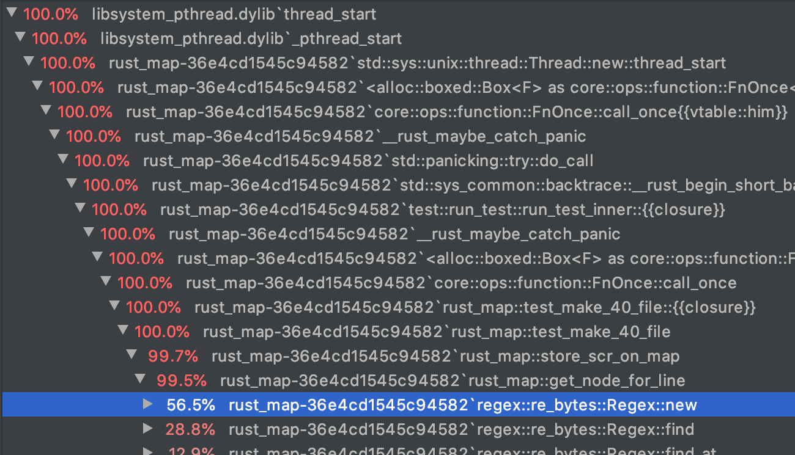
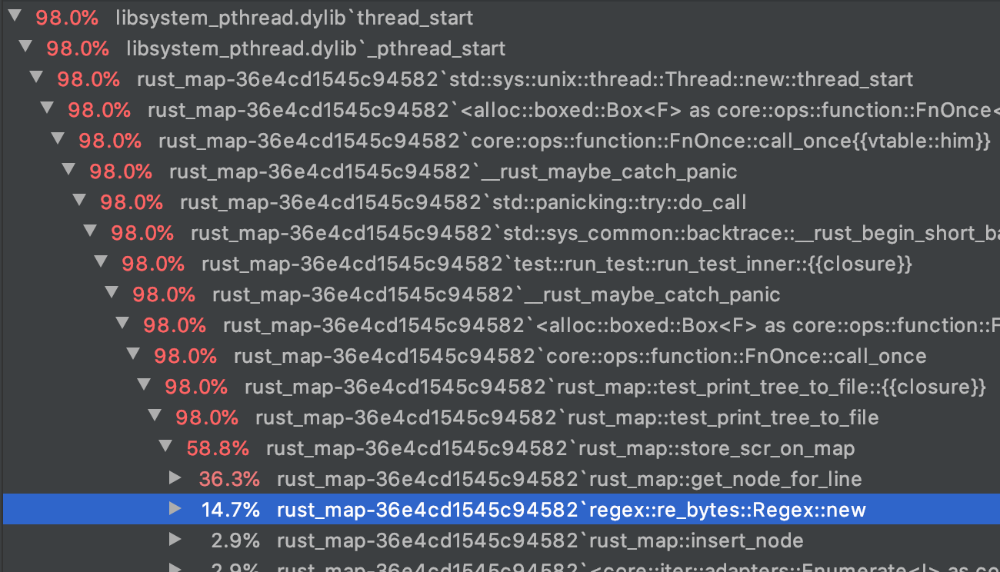
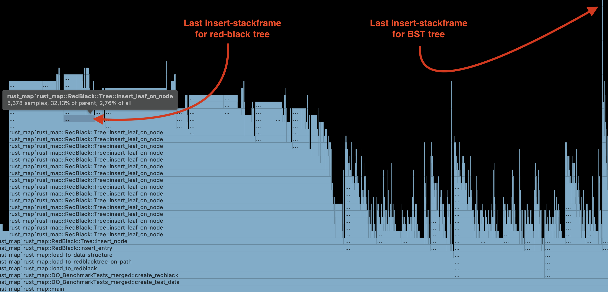

# Designing/implementing/evaluating an external map in Rust on modern hardware

# Abstract
<details>
  <summary>expand</summary>
This project focuses on how to efficiently search through key-value pairs on a machine with low resources. The data is a data set of 150 key-value pairs, where the keys are ranges between two values. The goal is to have an average lookup time of max 40 milliseconds, have a pre-processing time of max 24 hours, use at max 4 GB RAM and use at max 100GB disk space. This paper goes through the design and implementation of a BST, a Red-black Tree, and a table in Rust. All three implementations are compared and evaluated based on four experiments on memory usage, caching, search speed, and build speed. The experiments are performed on both a high and a low resources machine. Based on the experiments we can conclude that the implementations of all three data structures fulfil the requirements.

This project originates from an actual technical challenge Siteimprove had in their backend.

</details>

# 1 Introduction / Motivation

<details>
  <summary>expand</summary>
There are many ways and techniques of searching through huge data sets. There is not one technique that fits all cases. The most efficient search all comes down to what kind of data you have.

Searching in memory is fast compared to searching on disk. So, what do you do when you want to quickly search through a huge data set that cannot be stored in memory? On a small scale, the easy answer is to just buy a more powerful machine with more memory, but this is maybe not always what you want. Should you choose to run your application on a virtual machine on a cloud provider like DigitalOcean - then renting a machine with high resources quickly becomes expensive. If the data cannot be stored in memory it needs to be stored on persistent storage.

If the data set contains normal key-value pairs the usual choice is to store them in tables. If the keys are not singular values, but instead a range between two values, then the problem/implementation choice is more complicated. 

</details>

# 2 Problem formulation

<details>
  <summary>expand</summary>

Problem formulation as stated in the project description:
- Analyze the requirements from Siteimprove in terms of persistent log and key-value store
- Describe and analyze existing data structures and algorithms for persistent log and key-value stores
- Design/implement/evaluate a persistent log and key-value store in Rust on modern hardware


## 2.1 Method
The method is experimental. I will design, implement, and evaluate prototypes. The prototypes will be implemented in Rust and will be evaluated based on experiments.


## 2.2 Problem explained in detail
Siteimprove needs a web-service that can lookup information for a given IP address. The structure wrapped around the service (e.g. handling http request), is already implemented, so they need the new algorithm for the actual data storage and lookup. Siteimprove's service is implemented in Rust, and therefore they want the search algorithms to be implemented in Rust (or a language like C with a _foreign function interface_ (FFI), that can be called from a Rust application).

The primary focus is fast lookup so their customers can get a response/result as fast as possible. Pre-processing time is not relevant as long as it does not take more than a day. The data structure needs to be built once a week and does not need to handle new entry insertions after initial pre-processing.

Usually disk space is very cheap compared to RAM, but since the system may be run on a cloud provider, the disk usage should be kept under 100 GB.

Siteimprove wants a lookup time of a maximum of 40 milliseconds on average pr. request. That is the highest average lookup time they want to offer to their customers.

A part of the challenge of this project is to be able to run the service on a machine with low resources to pay less for hardware in the long run (especially if run on a cloud provider). Siteimprove wants a maximum memory usage of 4 GB memory, but I will strive for as low memory usage as possible.

Siteimprove has no need for persistent logging.


### 2.2.1 Data
The data is expected to be read via _standard input_, from a file, or read from a stream. Each entry consists of two IP addresses and some associated data/payload. The first IP determines the lower bound of the range and the second is the upper bound.

The payload pr. entry can vary in size, but the max payload size is 2^8 /256 bytes. It is not possible to access the real data due to confidentiality. The number of entries is not constant, so the system needs to be able to handle an arbitrary number of entries across the full IP range.

Siteimprove’s system needs to handle around 150 million IPv4 entries and 35 million IPv6 entries with a payload of up to 256 bytes. To limit the scope of this project I will focus on the 150 million IPv4 and draw parallels to how the different data structures would handle IPv6.

Assumptions for data
- The input data contains no overlapping ranges.
- All IP addresses are possible - (No IP range should be ignored because of reserved IP-range-blocks).
- There is no need to remove or change entries after insertion.
- The entries should be able to be streamed into the application so we will not know beforehand how many entries will go into the system.


### 2.2.2 Siteimprove’s requirements


```
- Language:              Rust (or some other language Rust can call into).
- Data set:              A set of 150 million IP ranges with payload.
                         No overlapping ranges.
                         IPs can be any IP in the full IPv4 range.
                         Up to 256bytes of payload pr. entry.
- Pre-processing-time:   Less than 24 hours.
                         No new entries after initial pre-processing.
                         No deletions or updates after initial pre-processing.
- Disk usage:            At most 100GB.
- Lookup time:           At most 40 milliseconds for average lookup time.
- Memory:                At most 4GB.
```

</details>


# 3 Data structures

<details>
  <summary>expand</summary>

There are many ways of searching through key-value pairs. The data for this project consists of ranges, which means that the choice of database type is not obvious and depends on different factors. It depends on range-size, gap-size (between each range), payload-size pr. entry, how many keys there can exist in total (if there is a finite number of possible keys), and the number of entries - and of course how complicated an implementation you want.

This project focuses on tables and tree structures.


## 3.1 Tables
A simple implementation of a table is to just create a full table for all IP addresses holding a value (the payload) for each IP. Obviously, this results in massive data duplication because a value is stored repeatedly for each key in the associated range. This can easily be improved by storing the value in another table and only storing a pointer to it. Now the value is only stored once, but instead the pointer to it is duplicated for each key. An illustration of this concept is shown in the figure below.


One of the downsides to this is that the full IP range is stored in the table even though you may only have very few entries. The solution is generally to create some kind of hashtable, where each key is hashed and points to another data structure (like a linkedlist) where the values are stored, but this is beyond the scope of this project.


## 3.2 Binary Trees
To prevent having a lot of duplicated pointers, another option is to store each entry as a node in a tree. A binary tree is a tree where each node has one parent and up to two children. A tree corresponding to the _binary search algorithm_ achieves the theoretical minimum number of key comparisons that is necessary to find a value. Binary search has a time complexity of *O(log n)* and we should aim for a tree structure with the same time complexity.

### 3.2.1 Binary Search Tree (BST)
BST is a type of binary tree in which the left child of a node has a value less than the parent and the right child has a value greater than the parent. On average, a BST with *n* nodes has a height of *O(logn)*. However, in the worst case, a BST can have a height of *O(n)*.

One of the choices you have to make is to decide if you want to store the payload in/next to the  node itself or the node should store a pointer to the payload somewhere else.

Pros for storing the payload in/next to the node:
- No need to spend time/resources looking up the payload in a different file.
- The payload probably gets cached when the node is loaded into memory, because it is stored in or next to the node.

Pros for storing it in a separate file:
- In terms of caching it can be more beneficial to store the payload on a different file because it would mean that the nodes would be stored closer to each other - and therefore, make better use of _locality_ while searching down the tree (more on this section 7.4).

Another interesting point is to decide on how you want to store the IP addresses. The simplest solution is to store the lower bound IP and the upper bound IP. When talking IPv4 each IP takes up 32 bits, resulting in 64 bits pr. node.

Another approach could be to store only the lower-bound and then store the delta to the upper-bound. This is useful if you know that the ranges will be small, meaning you could get away with storing the upper bound on fewer than 4 bytes (32 bits). This is only a useful optimization if you know how the ranges and gaps are distributed, but since we do not know that in this project we have chosen the simple solution of storing the full IP address for both upper and lower bound.

### 3.2.2 Red-black Tree
An extension of the Binary Search Tree is the Red-black Tree. A Red-black Tree is a self-balancing binary search tree. This prevents the tree from being imbalanced in exchange for longer build time and bigger nodes.

One important point to make is that it is not always beneficial to use a balanced tree. As Donald E. Knuth proves in _The art of computer programming_, the search time for the balanced tree does not perform much better than a non-balanced tree on random data. An unbalanced tree has a worst- case search time of *O(n)*, but this is very rare and most trees are well balanced. A Red-black Tree has a *~Log(n)* search time and a BST has a *~2·log(n)* search time. Therefore, both data structures have a search time complexity of *O(log(n))*. The increasing price of rebalancing the Red-black Tree on large random data inserts, may not always be worth the lower height.

In addition, the Red-black Tree can be implemented with an insertion-function that only needs to handle four base cases, which makes it a good choice for projects like this.

</details>

# 4 Design and Implementation

<details>
  <summary>expand</summary>

In this project, I have chosen an implementation of a Binary Search Tree (BST), a Red-black Tree, and
a table. All three implementations have their own module in the source code and have the same interface, so they can be swapped interchangeably. All data structures are implemented using memory mapped files. All three implementations use a separate memory mapped file for storing the payload. This memory mapped file with the payload will be referred to as `payload_map`. In all three implementations, I have chosen to store strings as payload, but this could be swapped out with any other data type.

Before diving deeper into the implementations, I want to highlight the difference between fixed data sizes vs. dynamic data sizes.

#### Fixed vs. dynamic data length
Depending on the problem you want to solve you can either choose to use the same fixed amount of space for each entry or have a dynamic size (only using the necessary amount of space for each entry). This decision is important because it determines how to store the payload and how we store the nodes in the tree, and how big the pointers to the payload need to be.

Fixed sized data could imply using structs, so the whole file is cut in equal-sized pieces (structs). You can then refer to the offset of the struct itself, and not only to the byte index of the struct. This is important because the byte index number will be much larger than the struct offset, resulting in more space is needed to store pointers to byte indexes.

In this project, I will refer to “struct offset” as the offset of the first byte in the struct, and I will refer to the “byte index” as the offset of a byte.

An illustration of this concept can be seen below in the figure below.


Struct offsets are favorable if you know that the data-object will always have the same size, but if the amount of data needed to be stored varies a lot, then we will waste space on internal fragmentation/adding in the structs because they are not “filled out”. Instead we can make all data-objects have a dynamic size. We will then have to store the size of the data-object as a header and need to use byte index to refer to the data.


## 4.1 Payload Map
The memory mapped file, `payload_map`, contains all entries' value/payload and the length of the values in bytes as a header. Payload varies in length, so we have to use byte indexes when referring to payload. A value is retrieved from the `payload_map` by giving it the byte index of the header of the value. Each lookup runs in constant time and therefore has a time complexity of *O(1)*.

Each value has a header of one byte, which is used to store the length of the data. This means that the payload can be at most 2^8 = 256 bytes long. This is just a design choice but could easily be extended by changing all headers to be 2 bytes long instead.

In the figure it is shown how `SKAT` would be stored in `payload_map`.


#### Space
The maximum space needed for this file can be calculated from the max payload size and the number of entries: *(2^8 + 1) · n*, where *n* is the number of entries. The *+1* is the header-size of one byte. If we have 150.000.000 entries with 256 bytes each, we can calculate the largest possible file to be 38.4GB. The space complexity is *O(n)*, where *n* is the number of entries.

## 4.2 BST & Red-black Tree
Both the BST and the Red-Black Tree are implemented similarly. Most functions are exactly the same, but with the exception of the insert-function ([`fn insert_node(...)`][4] in the source code) in the Red-black Tree being more extensive and the fact that the Red-black Tree has functions for changing the root-node.

<table>
<tr>
    <th>BST</th>
    <th>Red-black</th>
</tr>

<tr>
<td>

```rust
pub struct Node {
    pub min_ip: u32,
    pub max_ip: u32,
    pub left: u32,
    pub right: u32,
    pub payload_ptr: u64,
}
```

</td>
<td>

```rust
pub struct Node {
    pub red: bool,
    pub min_ip: u32,
    pub max_ip: u32,
    pub left: u32,
    pub right: u32,
    pub parent: u32,
    pub payload_ptr: u64,
}
```

</td>
</tr>
</table>


> `min_ip` is the lower bound of the IP range, `max_ip` is the upper bound of the IP range, `left` is the struct offset of the left child, ``right`` is the struct offset of the right child, parent is the struct offset of the parent, `payload_ptr` is the byte index of the payload that the node refers to. `min_ip` and `max_ip` are a `u32`, because IPv4 is 32-bit. Pointers to other nodes are `u32`, because we know that there will be at most 2^32 nodes, when the tree only handles IPv4.

#### Insertion
Each time an entry is added to the tree a new node will be appended at the end of the memory mapped file. Because all nodes have the same size, we can point to their node offset instead of their byte index. The only difference between the two trees is how we store the root-node. In the BST, we store the root node on struct offset 0 and in the Red-black Tree we store a pointer to the root-node in the first struct (as illustrated in the figure).


In the figure below, a simple example is shown of what it would look like if these three entries below were inserted in both the BST and the Red-black Tree.

```
0.0.2.8 0.0.2.8     SKAT
0.0.0.4 0.0.1.20    PWC
0.0.0.0 0.0.0.2     Siteimprove
```


Here we notice that the BST is not balanced and has _Node 0_ as root and the Red-black Tree is balanced and has _Node 2_ as root. Pointers to other nodes (left, right, parent) with value 0 are treated as a null-pointers.


#### Space
The space complexity of the trees is O(n), where n is the number of entries. Each node is a struct, which size can be found by simply using the function std::mem::size_of<T>() with the struct or manually be calculated by doing the following:

> - For each field in the struct ordered by declaration order:
>   - Add the size of the field.
>   - Round up the current size to the nearest multiple of the next field's alignment.
> - Finally, round the size of the struct to the nearest multiple of its alignment.

Following this algorithm, the BST nodes have a size of 24 bytes while the Red-black Tree’s nodes have a size of 32 bytes. Multiplying this with the 150 million entries, gives a total file size of 3.6GB for BST and 4.8GB for Red-black Tree.


```
BST:
Lookup time complexity: O(Log(n))
Insert time complexity: O(Log(n))
Space complexity: O(n)
Space: 24 bytes · n

Red-black:
Lookup time complexity: O(Log(n))
Insert time complexity: O(Log(n))
Space complexity: O(n)
Space: 32 bytes · n

Where n is the number of entries

```


#### Handling IpV6
Tree structures handle IPv6 well. The only change necessary would be to change the `min_ip` and
max_ip from `u32` to `u128` (and instead declare them at the bottom of the struct to prevent bad
alignment).


## 4.3 Table
This implementation is based on the implementation mentioned in section 3.1 Tables. This file consists of 2^32 (~4,3 million) unsigned longs, `u64`, that function as a pointer to lookup the value in the `payload_map`. This table I will refer to as `ip_table`.

In the figure below, a simple example is shown of what it would look like if the three entries below were inserted in the Table. The three entries are the same as shown in the previous section (section 4.2).

```
0.0.2.8 0.0.2.8 SKAT
0.0.0.4 0.0.1.20 PWC
0.0.0.0 0.0.0.2 Siteimprove
```


To symbolize a null-pointer (when IPs do not have any payload) we just store 0. This means that we need to add 1 to all pointers to differentiate between null-pointers and real pointers that point to the first value in `payload_map` at index 0. Therefore, we see in the figure above that *IP 4* with value *6* points to byte index *5*.

Space
The space needed for this IP table for IPv4 is 34.4 GB (_2^32 · 64/8/1000/1000/1000_) and the size of the space needed does not scale with the amount of entries inserted. The space complexity is *O(1)*.

Implementation overview:
```
Lookup time complexity: O(1).
Insert time complexity: O(r), where r is the length of range of the entry.
Space complexity: O(1)
Space: 2^32 · 64 bit = 34.4 GB
```

#### Handling IpV6
In practice this implementation will not work with IPv6. IPv6 is 128-bit instead of IPv4's 32-bit. The
number of possible IPs in IPv6 is 2^128 = 3,40 · 10 38 , and if all have to store a `u64`-pointer it results in a 2.7 · 10 30 GB file (_2^128 · 64/8/1000/1000_).


## 4.4 Why use Rust?
Rust is a multi-paradigm programming language, which supports imperative procedural, object- oriented, pure functional styles, and generic programming. It is a compiled programming language and it uses LLVM on the backend.

Rust has no runtime or garbage collector, which makes it good for performance and consistency, since it removes concepts like _Pause-Time Garbage Collection_. Rust performs similar to C, and hence makes a good choice for performance.

### 4.4.1 Safety
#### Memory safety
One of the main reasons for using Rust is its safety. In general, Rust does not allow null-pointers, dangling pointers, or race conditions. This is done among others by a combination of the concepts of ownership and lifetime, which are enforced at compile time.

Ownership is a concept where variables have ownership over data they are bound to. A piece of data can only have one owner at a time. When a binding goes out of scope, Rust will free the bound resources. This is how Rust achieves memory safety.

The concept of lifetimes enforces that if we have an array of items `[T]` and we create a reference to one of these items `&T` then that reference must leave scope before the array itself. In other words, the array needs to have a longer lifetime than pointers to its items - otherwise, the Rust compiler will refuse to compile because it cannot guarantee that the array is not freed or changed before accessing `T`.

Starting this project, I had no experience working with Rust. The above concepts and the strict compiler can be challenging to get used to, but in combination it gives a great safety. By using Rust, we have been able to eliminate dangling pointers, which can be a pain, when building a complex data structure with a lot of moving pointers.

#### Error handling
C does not provide good error handling, because the programmer is expected to prevent errors from occurring in the first place 11 . This means that C is much harder and unsafe to code combined with the fact that it is very difficult to debug.

High level languages like java and C# have mechanisms such as exceptions. Rust does not have
exceptions. Instead, Rust has two types of error handling `Result<T, E>` and `Option<T>`. An
Option can be seen as the same as a Result but without an error object/message. Both concepts are
used in the function below.

```Rust
pub(crate) fn get_u32_for_ip(s: &str) -> Option<u32> {
    let v: Vec<&str> = s.split('.').collect();
    let len = v.len();
    if len != 4 { return None }
    let mut acc: u32 = 0;
    for i in 0..len {
        match v[i].parse::<u8>() {
            Ok(n) => acc |= (n as u32) << ((len-1-i) * 8) as u32,
            Err(e) => return None
        };
    }
    Some(acc)
}
```

Option is used in the form of Some and None and Result is used in Ok(n) and Err(e). This function takes a string of four numbers separated by a dot . - e.g. 192.2.103.11 - and returns an unsigned integer wrapped in an Option. In this case, I use Option as a safe way to use a null-pointer. Being able to handle an error with ease is crucial when you need to deliver safe code quickly.

### 4.4.2 Memory Map Abstraction
Rust does not have an official interface/abstraction for using memory maps, but there exist a few open-source libraries created by the community.
Rust's package management system is called _cargo_ and it uses _crates_ as packages. This project uses a crate called `memmap` (version 0.7.0) 13 as an abstraction for memory mapped files. This library was chosen because it had the most stars on GitHub. The abstraction provided by this external library is not extensive compared to the one available in C, so the configuration for the memory map is not as customizable.

Rust has the ability to call functions in C files, and you can also use most of the C standard library inline by using the `libc`-library/crate. This means we can access functions like `mlock` and `mlockall`, should this be needed - but Rust’s memory safety cannot guarantee the result of these functions so it forces us to use the "`unsafe`" keyword. Overall, this means that we can use both Rust functions and C functions as we please, but we cannot guarantee what is going to happen.


#### Reading from Memory Map
This abstraction of a memory mapped file only knows the concept of bytes. The memory map can be
seen as one long byte-array.
Sometimes we cannot use Rust's safety, and this is where Rust works more like C.
```Rust
pub(crate) unsafe fn bytes_to_type<T>(slice: &[u8]) -> &mut T {
    std::slice::from_raw_parts_mut(slice.as_ptr() as *mut T, std::mem::size_of::<T>()).get_mut(0).unwrap()
}
```
This function returns a reference to a mutable object given a reference to a `u8`-array. This function
is used to get a reference to a node directly on the memory map. Here we have no guarantee of
what we are going to get, since it is just a pointer and a length that we force to become a reference
to type T. In this case we do not have any other way of reading data from the memory map, because
it only knows the concept of bytes.

</details>

# 5 Running the program

<details>
  <summary>expand</summary>
The program is run through the command-line. This version of the program can either generate data itself or read it from a file. What the program is supposed to do is specified with _flags_ and _options_ through the command-line. The full list of flags and options available can be found in appendix A.

Here we have some examples of how it works:
- Building the Red-black Tree from a file and searching for a specific IP:
`./rust_map --build_redblack --search_redblack --input_file MyFile.txt --specific_ip "160.5.211.97"`
- Searching in both BST and Red-black Tree for a specific IP on already built data structures:
`./rust_map --search_BST --search_redblack --specific_ip
"160.5.211.97"`
- To generate a data set of 100000 entries, building a table, and search through 2% (1/50) of the data set:
`./rust_map --generate_data --build_redblack --search_redblack -n 100000 --gap_size 50`

Some flags and options are an invalid combination. The program will tell you what is wrong and help you provide the right input. Here we have two examples of an invalid input:
- `./rust_map --build_redblack` where you do not specify an input file (`--input_file MyFile.txt`) and do not generate a new dataset (`--generate_data`). This is an invalid combination, because then the program does not have anything to build off.
- `./target/release/rust_map --specific_ip "160.5.211.97"`, where you tell it to search for that specific IP, but does not tell it which data structure to search in.

</details>

# 6 Testing, Debugging, and Profiling

<details>
  <summary>expand</summary>

## 6.1 Tests
To ensure the implementations of data structures function correctly I have tested them using unit tests and integration tests. An important note is that the tests have to be run with the flag `--test-threads 1`, to make sure they run sequentially, because many functions use the same memory mapped files, and this eliminates the risk of race conditions.

### 6.1.1 Unit tests
Most files and functions are tested using unit tests. All unit tests can be found in source-code in the same file as the function they are testing. The unit tests include both _positive tests_ and _negative tests_. Below I have chosen to highlight some of the more special tests.


#### Verifying tree structure
The unit tests include tests that check that the trees were built correctly. Both the BST and Red-black Tree can be printed to standard-output or a file, and both have a test to verify that the tree is printed correctly.

In the table below we see the printout to the left and the abstraction to the right of a Red-black Tree, where *O* is a black node and *X* is a red node. These tests run on a fixed data set (as opposed to randomly generated), which means we can check if every single line matches with what we expect. The test data for printing this output can be found in the repository.

<table>
<tr>
    <th>Standard-output</th>
    <th>Visual abstraction</th>
</tr>

<tr>
<td>

```
------X Huawei
---O Samsung
------X Google
O Siteimprove
------X PwC
---O SKAT
------X Apple
```

</td>
<td>
    
</td>
</tr>
</table>

The test above works on small data sets, but it does not scale, so I have added another test, that checks that the Red-black Tree is built correctly. The function can be seen below.
```Rust
fn is_tree_corrupt(mmap: &MmapMut, parent_red: bool, node: &Node) -> bool {
    if parent_red == true && node.red == true { return true }
    let right_is_corrupt = node.right != 0
        && is_tree_corrupt(mmap, node.red, NodeToMem::get_node(&mmap, node.right as usize));
    let left_is_corrupt = node.left != 0
        && is_tree_corrupt(mmap, node.red, NodeToMem::get_node(&mmap, node.left as usize));
    return right_is_corrupt || left_is_corrupt
}
```
This function traverses the Red-black Tree and checks if both a child and its parent are _red_, which is an illegal state, and should have triggered a rebalance. This function will return `true` if the tree is corrupted and `false` otherwise. In the source code, a positive and negative test is performed on 50.000 randomly inserted elements, to ensure that the Red-black Tree was built correctly. This test does not detect if any nodes are disconnected from the tree (nodes not reachable from the root), but other tests detect that.

### 6.1.2 Integration Tests
Since all three implementations of the data structures have the same interface, they can all be tested by using exactly the same functions.
The integration tests include:
-  Hardcoded input data and the requested IPs are also hardcoded
-  Hardcoded input data but the selected IP requests are a random subset of the hardcoded input data.
-  Randomly generated input data and the selected IP requests are a random subset of the input data.

The Integration tests go through a setup, build, and lookup phase.


#### Setup - Generating test files
This first phase generates lines of two IP addresses and one text string (e.g.: `125.74.3.0
125.74.3.10 Siteimprove`) and writes them to a file. This file I will refer to as `input_file`. All
lines are shuffled by using the Linux command shuf.

> Note: First, I tried shuffling all entries in memory inside Rust using a `Vec<&str>` and writing them to a file afterward, but this was slower and was more memory intensive than using the Linux command. Both methods require that all entries can be stored in memory at the same time. Therefore, the shuffling cannot happen on a machine with little memory, if the data set is large. The shuffling is only used in testing and has no use in production, so this is not a concern for the project.

#### Build data structure
The program iterates over each line in `input_file` reading them one by one with regex. Both the
tested data structure and `payload_map` need to be built at the same time, because the data
structure needs to know the byte index of the currently inserted entry in the `payload_map`. This
step is deterministic and will always provide the same output for the same input file. This phase is
the most expensive in terms of time.

> Note: All three implementations of the data structures produce the same `payload_map`, so they could share the same payload-file, but implementation-wise they all have their own in order to decouple the data structures.

#### Lookup
Testing lookup is done by selecting a set of IP requests and looking them up in one of the data structures. The random requests are collected by iterating over the entries in `input_file` and selecting every n'th entry (*n* is the number specified by the option `gap_size` mentioned in section 5. For each entry, a random IP is picked between the upper and lower bound. All the chosen entries are then shuffled again. The actual searching is done by iterating over the chosen IPs, and sequentially searching through the data structure and checking that it returns the correct payload. When finished, it will print the time it took to do all the lookups. This number is then used to calculate the average lookup time.


## 6.2 Debugging
Debugging the system was mostly done with print-lines and by stepping through the code with a debugger. It can be difficult to visualize how exactly each byte is placed in memory maps. The method I used to visualize it was to print the memory map in bytes to _standard output_. I used this statement `println!("{:?}", &payload_map[0..100]);`, which prints out each byte in the range of 0 to 100 of the memory mapped file: `[0,0,0,123,90,6 ... ]`. This way I could print the map before and after each operation and compare them, and check if it worked as intended.

When building the Red-black Tree there is an assert-check while balancing that checks that a child's parent-pointer is the same as its grandparents' child pointer (a visual representation can be seen in the figure below). This will detect errors, should the Red-black Tree end up being corrupted. This was crucial in the development process. I had a periodic issue where the Red-black Tree was being built incorrectly.


Eventually, I found out that the issue was caused by an assumption I had made, which was wrong. The assumption was that the nodes always had a different color when `swapColor(node1,node2)` was called, which is not true. After fixing this, I did not have any corrupted builds.


## 6.3 Profiling
A huge part of the performance optimization came from the built-in profiler-tool in _Clion_ (IDE made by Jetbrains). In particular, its _Flame Graph_ and _Call Tree_ was very helpful. This was mainly used for seeing how much time the process spent in each function to find bottlenecks. The profiler uses _sampling_. A sampling profiler takes a snapshot of the call stack at regular intervals using operating system interrupts. Sampling profiles are typically less accurate and specific but allow the program to run at close to full speed.

#### Call Tree
This was most useful at the beginning both for learning Rust and for detecting bottlenecks early on. E.g. in an earlier version of the project a new Regex-object was initialized every time it read a line from standard input. In the _Call Tree_, it was an obvious bottleneck - and was therefore changed to only getting initialized once and instead parsing a pointer to it around in the functions. This is a simple change but has a huge impact on performance.

<p float="left">
   
  
</p>

> On the left image of the _Call Tree_, we see how 56.5% of the time was spent initializing a Regex object, but on the right image it only took 14.7% of the time after the change was made.

#### Flame Graph
Still, after changing that, we can see in the profiler that almost half the time was spent on parsing the input-string to two `u32` and a payload-`string` when building a table with 50.000 entries. This can be seen by comparing the width of the block, `Utils::get_entry_for_line`, with the full width of `build_data_structure`-block in the figure below. Each block represents a stack-frame and the width of each block corresponds to the function’s CPU time used.


The height of the trees is also visible in the profiler in the flame graph. The figure below is an image from a profile run on a function that builds both the Red-black Tree, the table, and the BST with 100.000 entries with a frequency of 5000 samples pr. second. Since it ran with 100.000 entries we can expect a minimum height of the trees to be *log(100.000)=16*. In the flame graph, we can count how many stack-frames deep the Red-black Tree’s `insert_node` functions go. The last `insert_leaf_on_node`-stack-frame is *18* layers deep, which means that the height of the tree is *19* (*+1* because the inserted leaf also counts). This matches our expectations of a balanced tree. Furthermore, we can see that the BST height is almost double the height of the Red-black Tree. This also matches our expectations of an unbalanced tree height to have a height of *2·log(n)*, mentioned in _section 3.2.2 Red-black Tree_.



> Note: The BST may even be taller/deeper, since the profiler takes samples with a given interval, so if a stack-frame is added and removed to the call stack in the middle of two samples it would not be registered.

Another interesting finding was that Rust optimizes to _tail-end recursion_ when running it in release
mode (compiling with the `--release`-flag).

| Not in release mode | In release mode |
|:-----------:|:-------------:|
|  |  |

In the figure above we can see that there exists only one `insert_leaf_on_node`-stack-frame at
the time in release mode, revealing that the compiler has optimized to tail-end recursion.

</details>

# 7 Experiments and Evaluation

<details>
  <summary>expand</summary>

In the previous sections, I have explained the design and implementation of the three data structures: A table, a BST, and a Red-black Tree. To evaluate and compare these data structures and to see which ones live up to the requirements of the project I have made four experiments:
- Experiment #1: Memory Usage
- Experiment #2: Cashing
- Experiment #3: Search Time
- Experiment #4: Building Time


All experiments have run at least three times to limit the amount of random deviation. The numbers seen in the tables below (in the sections: _Results_) are averages of the tests results. If a data point had a lot of variation for each run, I ran it a few extra times to get a bigger sample size. If the time-scope for this project had been longer, I would have run more tests to get more accurate results. All the raw data from experiments can be found in the source code (in the folder named “Experiments”).

## 7.1 Experimental Constants
The full IP range for IPv4 is 2^32 = ~4.3 billion and the number of entries is 150.000.000. This means that there is a new range every 28th IP on average (2^32 /150.000.000 = 28.7 - I have rounded down to make sure the IP’s do not overflow the max IP address in the setup-phase explained in section 6.1.2). Since there is no information on how these are distributed, we will assume they are close to evenly distributed over the full range of IPv4.
Since on average there is a new range every 28th IP, we know that the average range size is less than 28 IP. Therefore, when we experiment on 150 million entries, we can set all ranges to be a random number between 10-18 and the gap between the ranges to be between 10-18. On average, this adds up to 28 so the full IP range will be covered. The range as well as the gap is a random number between two values, in order to add a diversity and make it a bit more realistic.
Evenly distributed ranges would suggest the worst-case scenario for the table, because the entries would be spread over more pages, than if all entries were close to each other in one subsection of the full possible IP range.

To see how the data structures handle different sized data sets, the experiments include data sets of 1000 entries, 100 thousand entries, 10 million entries, and 150 million entries. A data size of 100k entries still has a range of 10-18, but the padding/gap between each entry is ~42.936 (_2^32 /100.000 - 14±4(range)_).

The test data is generated as explained in section 6.1.2.

> In the sections Results below the constant for the tests are displayed in this format `range: 10..18, payload_size: 50, gap: 10`, where range is the range of each entry. `payload_size` is the size of the payload for each entry in bytes. `gap` is the number of entries it skips when it collects random lookup data. A gap of 10 basically means that 1 out of 10 entries will be requested in an experiment.


## 7.2 Machines
The experiments have been run on two machines with different memory size.
- *Droplet*:      1 GB memory machine hosted on DigitalOcean.
- *Dionysos*:     128 GB memory machine.
The focus of this project is to search on the Droplet with 1 GB memory, so this will be my focus for the final evaluation - but I still use Dionysos as a benchmark for comparisons. A more detailed list of hardware specifications can be found in the repository.

I shared Dionysos with another person, so I cannot guarantee what else was running on the computer, while I was experimenting, but we tried to coordinate as much as possible so this should have minimal impact.

## 7.3 Experiment #1: Memory Usage
<details>
  <summary>expand</summary>

### Expectation
Memory is an important factor when working with memory mapped files. I would expect the kernel to keep loading in pages as long as there is free memory left in main memory - and only start offloading pages when main memory is close to full.

A page is 4kb, which means that if we in a memory mapped file access data at least once every 4kb, we will load all pages in the whole file. So, if we build the table with 150 million entries and a gap of 10-18 bytes, we will have to load in all 34.4 GB (2^32 · 64 bits). This is of course not possible on a 1 GB memory machine, so the system must start offloading pages again. The victim page is chosen by the page fault handler in the memory system. If it keeps loading and offloading the same page it is known as _thrashing_, since it keeps asking for something and throwing it away even though it needs it again soon. This is a challenge for the table when IP requests are random because the kernel cannot predict what to keep in memory.

Overall, the expectation is that the kernel will keep loading in pages until all memory is used. 

### Results
To test this, I built a table on the two machines, with 150 entries, and checked the memory usage, before and during the building of the table. Here we would expect it to use all memory available and after start loading and offloading pages. To track the memory usage, I used the Linux command free, that prints the current memory usage before and while the program was running.


**Memory Usage**
| Structure     | Droplet       | Dionysos  | 
| ------------- |--------------:| ---------:|
| Idle          | 106mb         | 9783mb    |
| Running       | 168mb         | 9844mb    |
| Difference    | 62mb          | 61mb      |

> _Idle_ means when the machine is doing nothing, _Running_ is when the program is running, and _Difference_ is the delta between running and idle

The free-command was run many times during the build of the data structure, and already after building 2% of the input data, the memory usage stopped increasing and had a stable memory usage during the rest of the building process.

### Discussion
In the results above, we see that both machines both use 61mb-62mb, which shows that the memory usage did not keep growing. This suggests that something does not work as expected and it starts paging before all memory is used. This can also be seen by looking at the digital oceans monitoring tool (figure below). Looking at Droplet during one of the weeks, where the experiments were performed, it never got over 33% memory usage.


In a follow-up experiment I tracked how much the page cache filled up by using the same `free`-
command, but with `-w`-flag enabled to see how much was cached in the page cache.
Running the same experiment with the `-w`-flag enabled printed in the following results:

**Page Cache**
| Structure     | Droplet       | Dionysos  | 
| ------------- |--------------:| ---------:|
| Idle          | 56mb          | 1371mg    |
| Running       | 754mb         | 38709mb   |
| Difference    | 698mb         | 37337mb   |


The Droplet’ cache size stopped increasing after loading in only 2 percent of the data, and stayed stable for the rest of the run. This tells us that the Droplet started paging after 2 percent was built. On the other hand, Dionysos’ page cache kept increasing until it was done building the whole table. As described in section 4.3 the table takes up 34.4GB. This shows us that Dionysos loaded in all pages for the full table in the page cache, and never swapped out any pages, because there was always more unused memory left for the page cache to use.

This shows that the low memory usage is caused by the memory map loading pages into the page cache. The page cache is an otherwise unused portion of RAM that the kernel uses to store the pages loaded from secondary storage via explicit I/Os (as opposed to access via virtual pages). The page cache is dynamically allocated by the operating system, but for some processes (depending on OS parameters) there are limits to the portion of page cache which is available.

The size of page cache is difficult to predict and control, because it is entirely handled by the operating system, which can steal and swap page cache between different cgroups (control groups) if necessary.

Overall, my expectation was wrong. The kernel loads pages into the page cache, which is controlled entirely by the operating system and the operating system does not count/display the memory dynamically allocated by the page cache as used memory.

</details>

## 7.4 Experiment #2: Caching

<details>
  <summary>expand</summary>

A Cache-miss experiment is performed to track how the cache may impact the performance of data structure. For testing the cache, I used the Linux command `perf stat -e task-clock, cycles, instructions, cache-references, cache-misses [input]` on the machines. Between each step the cache is cleared by using the command `sync; echo 3 > /proc/sys/vm/drop_caches`, to make sure we start from a cold cache and that each test is not affected by the previous one.

### Expectation
In theory, the cache should not matter if the data set consists of an infinitely large amount of entries because the cache would be thrashed anyway. But on a more realistic scale (like in this project) this can become a factor when it comes to speed.

The immediate thought would be that the trees would have better caching performance than the table, since the nodes closer to the root would be read much more often than the rest of the tree (_temporal locality_). This should result in the data stored in the upper nodes most likely will be retrieved from the cache.

In addition to that I would assume the BST to make better use of _spatial locality_, because when you are searching down the BST, you search in one direction through the file, and the nodes are often close to each other in the file. 


E.g. in the BST the root is always at node offset 0, and all nodes in the tree will always be to the right from their parent on the same page or the following pages. On the other hand, the Red-black Tree‘s root could, in theory, be in the middle of the file, and its children could be far apart. This means that the Red-black Tree has a bigger chance of cache misses and page faults.
We expect the percentage difference between the trees to increase the bigger the data set, because the Red-black Tree’s nodes will increasingly be spread out more.


For this implementation, it is difficult to isolate the cache-miss counting only to the searching/lookup. This is caused by the fact that the lookup-step (mentioned in section 6.1.2) includes generating search input, the _actual lookups_, and _looking up the payload_ in the `payload_map`.

Both the _generation search input_ and _looking up the payload_ are the same steps for all three data structures, suggesting they can be seen as a constant factor in the experiment. This means that generating and looking in `payloads_map` should be stable for all results. This experiment was performed with a payload size of _1 byte_ to make sure that almost all access in the `payload_map` was cached.

### Results
The tests for this experiment have been run on both Dionysos and the Droplet. The script for producing the results can be found in the root of the repository. The table below shows cache-miss percentages printed by the `perf stat`-command.

**Dionysos**
| Structure     | 1k            | 100k      | 10mil     | 150mil        |
| ------------- |--------------:| ---------:| ---------:| -------------:| 
| BST           | 36.1 %        | 54.7 %    | 61.4 %    | 68.2 %        |
| Red-black     | 34.5 %        | 52.9 %    | 76.4 %    | 76.4 %        |
| Table         | 35.1 %        | 79.9 %    | 83.7 %    | 78.9 %        |

**Droplet**
| Structure     | 1k            | 100k      | 10mil     | 150mil        |
| ------------- |--------------:| ---------:| ---------:| -------------:| 
| BST           | 29.9 %        | 26.4 %    | 42.2 %    | 30.1 %        |
| Red-black     | 40.4 %        | 29.2 %    | 25.0 %    | 42.3 %        |
| Table         | 48.8%         | 25.0 %    | 9.0 %     | 40.6 %        |

> Occasionally it occurred that the cache miss randomly dropped to 1% for data sizes of 10mill and 150mill. This occurred 5% of the time. These results are not in-calculated in the results above.


### Discussion
Starting with Dionysos, the Red-black Tree has more cache misses compared to the BST for 10mill entries and 150mill entries. Again, this can be explained by the BST's better use of spatial locality. On the other hand, for 1k and 100k the Red-black Tree has less cache-misses than the BST. This may be caused by the fact that there are less entries overall and therefore a higher percentage of the nodes is already loaded and therefore a lower tree height may be more important than spatial locality. For 100k, 10mill, and 150mill the table has the highest cache miss percentage, which is expected because all requests are random, so it cannot predict what to keep in memory.

For the Droplet, the data is more inconsistent. This may be because the Droplet is a virtual machine stored on a DigitalOcean data center, where all their customers have their own hosted virtual machine on the same machines. This can cause inconsistencies in the resources provided to our Droplet.


</details>


## 7.5 Experiment #3: Search Time

<details>
  <summary>expand</summary>

### Expectation
We would assume that the table has the fastest search/lookup time, followed by the Red-black Tree, followed by the BST. A lookup in the table runs in constant time because it only needs to do two lookups (once in the `ip_table` and once in `payload_map`). Both trees should have a *O(log(n))* lookup time complexity, but I would expect the BST to be slower than the Red-black Tree because it is not balanced and therefore needs more key comparers to reach deeper nodes.

Based on the result of _Experiment #1_, I would expect Dionysos to be faster than the Droplet, because it can store more pages in the page cache.

### Results
This experiment has been run on both Dionysos and the Droplet. All tests are run with: `range: 10..18, payload_size: 50, gap: 10`. The numbers in the table below are the average lookup time pr. requested IP. All numbers are in microseconds.
These speed tests were run right after the building of the data structure without clearing the page cache. This was done to maximize speed by having as many pages already in memory as possible. The script for producing the results can be found in the root of the repository.

**Dionysos**
| Structure     | 1k            | 100k      | 10mil     | 150mil        |
| ------------- |--------------:| ---------:| ---------:| -------------:| 
| BST           | 2.50          | 0.88      | 2.17      | 3.71          |
| Red-black     | 2.78          | 1.00      | 1.75      | 3.25          |
| Table         | 7.09          | 3.85      | 3.44      | 0.95          |

**Droplet**
| Structure     | 1k            | 100k      | 10mil**   | 150mil**      |
| ------------- |--------------:| ---------:| ---------:| -------------:| 
| BST           | 1.45          | 0.85      | 324,10    | 6731.96       |
| Red-black     | 1.47          | 0.84      | 1284,22   | 7417.70       |
| Table         | 5.52          | 4.52      | 2157.37   | 5997.26       |

> ** The Droplet cannot build these data sizes (as explained in the next experiment, _Experiment #4_), so it had to be built on Dionysos and copied to the Droplet. This means that the cache was cold, and no pages were loaded into memory before the speed test was run.

### Discussion
Starting with Dionysos, we can see that the table is the fastest on the 150mill data set, which was what we expected, because it runs in constant time and only has two lookups pr. entry.

One thing that is interesting is that on both machines both trees follow along well. One could expect that the Red-black Tree would have double the speed of the BST, because of the lower height, but this is not the case. The Red-black Tree may have fewer key-comparisons/node-accesses than the BST, but nodes are more spread out in the file because of rebalancing (as described in the previous experiment, _Experiment 2_). This results in poor use of _spatial locality_ by the Red-black Tree, which results in more page misses and slower search speed. Another reason that the BST and the Red-black Tree have similar performance, could be that the nodes in the Red-black Tree are bigger and therefore fewer nodes can be stored on the same page. This means that the Red-black Tree will also get more page faults because less nodes can be loaded at the same time. This also has an impact on the performance, but this should be minimal, though.

For smaller data sizes the table is worse than the trees. Even though the table has fewer lookups, it performs relatively worse if the ranges are spread out (bigger space between them), since the entries would be placed further apart from each other in the file and therefore the table cannot load multiple ranges in each page. The requests are random, and the ranges are close to evenly distributed over the whole IPv4-range. This means that all entries are equally likely, and that there is no pattern in which IPs are accessed. The kernel has no way of guessing what to load next. The trees, on the other hand, would perform better on smaller data sizes, because all nodes are stored right next to each other on the file and will, therefore, be loaded on the same page and will be cached. This can answer why the table is much worse than the trees on smaller more-spread-out data.

For both machines, we see a time increase from 1k to 100k for all three data structures. The reason for the high lookup average of 1k entries, is probably the overhead of print-lines to standard-out. I implemented (not using an external library) a simple progress bar that prints a dash (-) every time it has processed 1% of the entries (both for searching and building) and flushing immediately (because I had an issue of the progress bar not being up to date). This has close to no impact, when there are 150 million entries, but it is a lot when there are 1k entries, and it has to stop and flush every 10th entry. This should probably have been a feature you could toggle with a flag.

We notice that both machines perform relatively evenly on smaller data sizes (1k and 100k). This is probably because their cache is not full at that time, so neither of the machines starts swapping pages.

It is also important to note that when the data set is smaller, the statistical power is lower. E.g. when we do 1000 entries and 10% lookup, only 100 requests are run which is a much lower sample size than 15.000.000, which we have with full 150 million entries. We just have to keep this in mind when reading the results.

</details>

## 7.6 Experiment #4: Build Time

<details>
  <summary>expand</summary>

### Expectation
For this project, there were no system requirements for the machine that should build the data structure. The only requirement was that it had to be built in less than a day. This experiment has been run on Dionysos.

#### Table
The table should primarily be limited by write speed. It should insert each entry in linear time *O(r)*, where r is the range of entry, since the insertion time does not grow with the number of entries, but it has to repeatedly store a pointer to the `payload_map`, for each IP in the range. In these experiments, we have a range ranging between 10 and 18, so the table must insert 10-18 pointers per entry. Therefore, the insertion time complexity can be seen as constant *O(1)*. I would expect the table to be fastest on a large data set, because of the constant insertion time compared to the trees' *log(n)* insertion time.

#### BST
The BST only writes twice to memory. Once for placing the node/struct in the map and once redirecting its parent’s pointer. But the slowing part is that the algorithm must search down the tree every time leaving it with *O(Log(n))* insertion time. I would expect the BST to be the fastest on smaller data sets because all nodes are stored next to each other in the file (great use of locality) and most nodes would probably be loaded in the page cache.

#### Red-black Tree
The Red-black Tree is more difficult to predict because it also must balance the tree. Balancing the tree requires reads and writes to multiple nodes above the newly inserted node, and potentially many more if a rotation is needed. In this implementation, it does not save a reference to the nodes it encounters down the search, so when balancing it must re-access/request the node in the memory map. This should not be an issue when the balancing is only one rotation, but this will be an increasing problem when the tree grows, and bigger rotations happen.
Furthermore, as described in _Experiment #2_, we must remember that the nodes in the Red-black Tree are stored more spread out compared to the BST, with less use of locality.
Overall, I would expect the Red-black Tree to be the slowest in all cases, because of the huge amount of node accesses.

### Results
This experiment was done by running the script found in the root of the repository 27 . All numbers are in microseconds. All tests are run with: `range: 10..18, payload_size: 50`.

**Build time per data structure**
| Structure     | 1k            | 100k      | 10mil     | 150mil        |
| ------------- |--------------:| ---------:| ---------:| -------------:| 
| BST           | 3917          | 206485    | 29928726  | 835904134     |
| Red-black     | 62624         | 6276430   | 647125934 | 11516763374   |
| Table         | 21924         | 1202969   | 155465193 | 960806939     |

**Average insertion time per entry per data structure**
| Structure     | 1k            | 100k      | 10mil     | 150mil        |
| ------------- |--------------:| ---------:| ---------:| -------------:| 
| BST           | 3.91          | 2.06      | 2.99      | 5.57          |
| Red-black     | 62.62         | 62.76     | 64.71     | 76.78         |
| Table         | 21.92         | 12.03     | 15.55     | 6.41          |

An interesting thing to notice was that the searching actually speeds up on Dionysus when building the trees, but not on the Droplet. This is because Dionysos can keep loading in pages so more and more pages will be cached, but this is not the case for the Droplet, so it doesn't speed up.

### Discussion
The first thing we notice is that the Red-black Tree is the worst performing data structure, just as we had expected.

As described in the previous experiment, _Experiment #3_, building the data structures also makes use of the progress bar made from flushed print-lines. Again, this has a meaningful overhead on small data sizes, which is probably why we see a decrease from 1k to 100k in average insertion time for both the table and the BST.

One interesting point is that the percentage difference between the BST and the table decreases the bigger the data size (besides the jump from 1k to 100k, as described in the paragraph just above). The percentage difference between them goes from 139% -> 141% -> 135% -> 14% (calculations can be found in appendix B), which indicates that the table will catch up to the BST the bigger the data set. This is expected considering constant time scales are better than logarithmic time. For bigger data sets the table may have been a better option, but not for this data size.

This experiment was also tried on the Droplet, but with less success. When building the Red-black Tree with 150mill data size, I stopped the Droplet after 10 hours after seeing that it had only inserted ~15% of the test data and therefore would not be able to finish in time, building at that rate. It was never a requirement to be able to build the data structure on a low resource machine, but it could be interesting to do an experiment on how long it would take on different data sizes.

The longest build time is the Red-black Tree with a build time of 3.2 hours, which is way below the one-day limit. Based on these numbers we can conclude that all the data structures are a viable option if run on a machine with specs like Dionysos. This build time will increase, the slower the machine is. In the future, it could be interesting to experiment on how low the specs can be and still be able to build in 24 hours.

The best performing data structure seems to be the BST. This is probably due to a combination of only two writes to memory and good use of locality. From this experiment, we can conclude that the Red-black Tree is the least scalable solution, with this specific implementation.

</details>

</details>

# 8 Conclusion

<details>
  <summary>expand</summary>

The project has gone through the design, the implementation, and the evaluation of three data structures: a BST, a Red-black Tree, and a table.

The overall conclusion is, that all three data structures - the BST, the Red-black Tree, and the table - live up to the requirements of at max 24 hours pre-processing/build time, at max 40 milliseconds lookup time, at max 4GB memory usage, and at max 100GB disk space usage when given 150 million IPv4 entries with up to 256 bytes of payload.

Siteimprove wants an implementation with an average lookup time of max 40 milliseconds. My implementations do not run on real data and are based on assumptions regarding range size and distribution as well as average payload size that may not be true. Based on this, I will not draw any definitive conclusions on whether any of my implementations is what they need. However, the experiments indicate that my implementations live up to their requirement for lookup time by a factor of 5-6, since my fastest implementation runs in ~6.0 milliseconds and my slowest run in ~7.4 milliseconds on a 1GB memory machine. Also, the experiments have shown that having more memory available speeds up the system significantly. This shows that if you wanted to run the system on a 4GB machine (which Siteimprove said was the highest memory usage they allowed) the systems would run even faster than on the 1GB memory Droplet. Since the implementations live up to both main memory usage and speed by a significant margin, Siteimprove can either increase the RAM from 1 to 4 to get a speed boost, or stay at 1GB and save the hardware resources.

The three implementations have a pre-processing time of less than a day, when built on a machine with enough resources. The data structure with the slowest pre-processing is the Red-black Tree, and was completed in 3.2 hours on Dionysos.

The three implementations use less than 100GB disk space. The implementation/data structure with the highest disk usage is the table with a combined disk usage of 72.8 GB (34.4GB for the `IP_table` - 38.4GB for the `payload_map`).

An additional conclusion is that the choice of data structure depends on a number of conditions and requirements.

I will conclude that for a data size of 150 million entries of IPv4 the table implementation is the best option, since it gives the fastest average lookup time, and it can easily be built in less than a day (if built on a machine with enough resources).

Against my expectation, the BST and the Red-black Tree perform similarly on both Dionysos and the 1GB memory Droplet as seen in _Experiment 3_ (the search experiment). This is probably because of the BST’s better use of locality and its smaller nodes. I will conclude that both trees are a viable option and the choice will depend on whether you prefer faster build time, faster lookup time, or a less complex implementation.

As described in _section 2.2_, Siteimprove also needs to handle at least 35.000 IPv6 addresses. This will not work with a table, since a disk of 2^128 u64-pointers (2.7 · 10^30 GB file) is not realistic, but it can easily be achieved with the Red-black Tree and the BST. Either by letting each node contain two `u128` instead of two `u32` for IPs or just have a separate memory mapped file for all IPv6 entries to reduce internal fragmentation (for storing an IPv4 address in a block of `u128`). I would suggest doing a mix of both a tree and a table. Having a table for the IPv4 and having a tree for IPv6.

</details>

